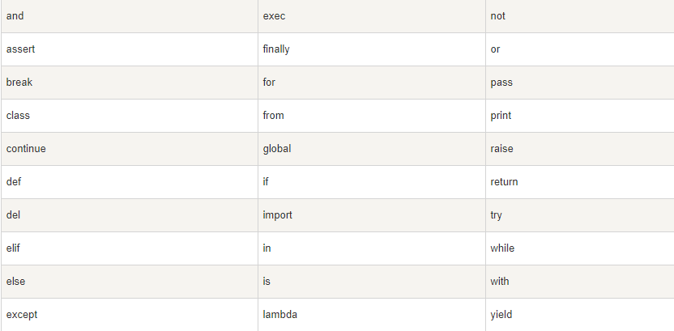
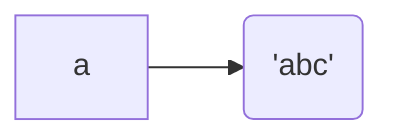
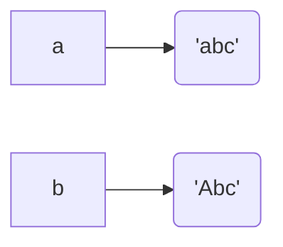

## Python入门

Python 是一种解释型、面向对象、动态数据类型的高级程序设计语言。

Python 由 Guido van Rossum 于 1989 年底发明，第一个公开发行版发行于 1991 年。

像 Perl 语言一样, Python 源代码同样遵循 GPL(GNU General Public License) 协议。

> 简介


> 发展历史


> 特点


## Python基础

### 注释

- 单行注释

  ```python
  # 单行注释
  ```

- 多行注释

  ```python
  '''
  多行注释
  多行注释
  '''
  
  """
  多行注释
  多行注释
  """
  ```

  

### 标识符

- 标识符由字母、数字、下划线组成，但**不能以数字开头**。

- Python标识符是==**区分大小写**==的。

- 以下划线开头的标识符是有特殊意义的。以单下划线开头 `_foo` 的代表不能直接访问的类属性，需通过类提供的接口进行访问，不能用 `from xxx import *`而导入。

- 以双下划线开头的 `__foo` 代表类的私有成员，以双下划线开头和结尾的 `__foo__` 代表 Python 里特殊方法专用的标识，如 `__init__()` 代表类的构造函数。

- Python 可以同一行显示多条语句，方法是用分号 **;** 分开。


### 关键字




### 数据类型及变量

> 整数
>

Python可以处理任意大小的整数（正，负，0）

对于较大的数，可以用_分隔，例如：10_000_000_000，十六进制数：0xa1b2_c3d4

> 浮点数

对于较大的或较小的浮点数，用科学计数法：1.23e9（1.23*10^9）

> 字符串

字符串：`'`或`"`括起来的文本；

- 字符串内包含`'`与`"`时，用转义字符`\`标识

  ```python
  # 语句内容：I'm "OK"!
  >>>'I\'m \"OK\"!'
  ```

- `\n`表示换行，`\t`表示制表符，`\\`表示`\`，可以用`r''`表示`''`内部字符串默认不转义

  ```python
  >>> print('\\\t\\')
  \       \
  >>> print(r'\\\t\\')
  \\\t\\
  ```

- 若内部有很多需要换行，可以用`'''...'''`表示多行内容，注意在输入多行内容时，提示符由`>>>`变为`...`，提示你可以接着上一行输入，注意`...`是提示符，不是代码的一部分。

  ```python
  >>> print('''line1
  ... line2
  ... line3''')
  line1
  line2
  line3
  ```

- 多行字符串`'''...'''`还可以在前面加上`r`使用

> 布尔值

一个布尔值：True 或者 False（注意大小写）

可运用于或与非、条件判断

> 空值

空值可用`None`表示，他不等同于`0`，`0`是有意义的，`None`是一个特殊的空值

> 变量

- 变量可以是数字，也可以是任意数据类型

- 变量在程序中就是用一个变量名表示了，变量名必须是大小写英文、数字和`_`的组合，且不能用数字开头

**这种变量本身类型不固定的语言称之为==动态语言==，与之对应的是==静态语言==。静态语言在定义变量时必须指定变量类型，如果赋值的时候类型不匹配，就会报错。例如 Java 是静态语言**

```java
int a = 123; // a是整数类型变量
a = "ABC"  // 错误：不能把字符串赋给整型变量
```

> 常量

常量就是不能变的变量

但事实上`PI`仍然是一个变量，Python根本没有任何机制保证`PI`不会被改变，所以，用全部大写的变量名表示常量只是一个习惯上的用法


【注】整数和浮点数在计算机内部存储的方式是不同的，==整数运算永远是精确的==（除法难道也是精确的？是的！），而浮点数运算则可能会有四舍五入的误差。

> 整数的除法运算（永远是精确的）

1. 除法：`/`，计算结果都是浮点数
2. 地板除：`//`，计算结果都是整数（因`//`只取整数，故Python提供了余数运算，可以得到两个整数相除的余数）


**总结：**

- Python 支持多种数据类型，在计算机内部，可以把任何数据都看成一个“对象”，而变量就是在程序中用来指向这些数据对象的，对变量赋值就是把数据和变量给关联起来。

- 对变量赋值`x = y`是把变量`x`指向真正的对象，该对象是变量`y`所指向的。随后对变量`y`的赋值不影响变量`x`的指向。

- Python 的**整数没有大小限制**，而某些语言的整数根据其存储长度是有大小限制的，例如

  Java 对32位整数的范围限制在`-2147483648`-`2147483647`。

  Python 的**浮点数也没有大小限制**，但是超出一定范围就直接表示为`inf`（无限大）。


### 字符串和编码

> 字符编码

一个字节（byte）= 8个比特（bit）

- ASCII编码：127个字符          
- Unicode编码
- UTF-8编码：UTF-8编码把一个Unicode字符根据不同的数字大小编码成1-6个字节，常用的英文字母被编码成1个字节，汉字通常是3个字节，生僻的字符才会被编码成4-6个字节

在计算机内存中，统一使用Unicode编码，当需要保存到硬盘或者需要传输的时候，就转换为UTF-8编码。

在记事本编辑时，从文件读取的UTF-8字符被转换为Unicode字符到内存里，编辑完成后，保存的时候再把Unicode转换为UTF-8保存到文件；

浏览网页的时候，服务器会把动态生成的Unicode内容转换为UTF-8再传输到浏览器；


> 字符串（以Unicode编码的，直接支持多语言）

- 单个字符

  ```python
  # ord() -- 获取字符的整数
  # chr() -- 编码转换为相应的字符
  >>> ord('A')
  65
  >>> ord('中')
  20013
  >>> chr(66)
  'B'
  >>> chr(25991)
  '文'
  ```

  若知道字符的整数编码，可用十六进制编写

  ```python
  >>> '\u4e2d\u6587'
  '中文'
  ```

- Python的字符串类型为`str`，，在内存中以Unicode表示，一个字符对应若干个字节。如果要在网络上传输，或者保存到磁盘上，就需要把`str`变为以字节为单位的`bytes`。

- Python对`bytes`类型的用带`b`前缀的单引号或双引号表示：

  ```python
  x = b'ABC' # bytes    bytes的每个字符都只占用一个字节。
  x = 'ABC' # str
  ```

- 纯英文的`str`可以用`ASCII`编码为`bytes`，内容是一样的，含有中文的`str`可以用`UTF-8`编码为`bytes`。含有中文的`str`无法用`ASCII`编码，因为中文编码的范围超过了`ASCII`编码的范围，Python会报错。

  ```python
  # str --> bytes    使用encode()方法
  >>> 'ABC'.encode('ascii')
  b'ABC'
  >>> '中文'.encode('utf-8')
  b'\xe4\xb8\xad\xe6\x96\x87'
  >>> '中文'.encode('ascii')
  Traceback (most recent call last):
    File "<stdin>", line 1, in <module>
  UnicodeEncodeError: 'ascii' codec can't encode characters in position 0-1: ordinal not in range(128)
  ```

  

- 如果我们从网络或磁盘上读取了字节流，那么读到的数据就是`bytes`。要把`bytes`变为`str`，就需要用`decode()`方法

  ```python
  # bytes --> str
  >>> b'ABC'.decode('ascii')
  'ABC'
  >>> b'\xe4\xb8\xad\xe6\x96\x87'.decode('utf-8')
  '中文'
  
  # 如果bytes中包含无法解码的字节，decode()方法会报错
  >>> b'\xe4\xb8\xad\xff'.decode('utf-8')
  Traceback (most recent call last):
    ...
  UnicodeDecodeError: 'utf-8' codec can't decode byte 0xff in position 3: invalid start byte
      
  # 如果bytes中只有一小部分无效的字节，可以传入errors='ignore'忽略错误的字节
  >>> b'\xe4\xb8\xad\xff'.decode('utf-8', errors='ignore')
  '中'
  ```

- `len()`函数计算的是`str`的字符数，如果换成`bytes`，`len()`函数就计算字节数

  ```python
  # len(str)
  >>> len('ABC')
  3
  >>> len('中文')
  2
  
  # len(bytes)
  >>> len(b'ABC')
  3
  >>> len(b'\xe4\xb8\xad\xe6\x96\x87')
  6
  >>> len('中文'.encode('utf-8'))
  6
  
  # 经过UTF-8编码后，1个中文字符占用3个字节，1个英文字符占用1个字节
  ```

- 在操作字符串时，我们经常遇到`str`和`bytes`的互相转换。为了避免乱码问题，应当始终坚持使用UTF-8编码对`str`和`bytes`进行转换。

  由于Python源代码也是一个文本文件，所以，当你的源代码中包含中文的时候，在保存源代码时，就需要务必指定保存为UTF-8编码。当Python解释器读取源代码时，为了让它按UTF-8编码读取，我们通常在文件开头写上这两行：

  ```python
  #!/usr/bin/env python3
  # -*- coding: utf-8 -*-
  ```

  第一行注释是为了告诉Linux/OS X系统，这是一个Python可执行程序，Windows系统会忽略这个注释；

  第二行注释是为了告诉Python解释器，按照UTF-8编码读取源代码，否则，你在源代码中写的中文输出可能会有乱码。

  申明了UTF-8编码并不意味着你的`.py`文件就是UTF-8编码的，必须并且要确保文本编辑器正在使用UTF-8 without BOM编码：

  如果`.py`文件本身使用UTF-8编码，并且也申明了`# -*- coding: utf-8 -*-`，打开命令提示符测试就可以正常显示中文：


> 格式化

- 在Python中，采用的格式化方式和C语言是一致的，用`%`实现

```python
>>> 'Hello, %s' % 'world'
'Hello, world'
>>> 'Hi, %s, you have $%d.' % ('Michael', 1000000)
'Hi, Michael, you have $1000000.'
```

`%`运算符就是用来格式化字符串的。在字符串内部，`%s`表示用字符串替换，`%d`表示用整数替换，有几个`%?`占位符，后面就跟几个变量或者值，顺序要对应好。如果只有一个`%?`，括号可以省略。

| 占位符 | 替换内容     |
| :----- | :----------- |
| %d     | 整数         |
| %f     | 浮点数       |
| %s     | 字符串       |
| %x     | 十六进制整数 |

其中，格式化整数和浮点数还可以指定是否补0和整数与小数的位数：

```python
>>> print('%2d-%02d'%(3,1))
 3-01
>>> print('%.2f'%3.1415926)
3.14
```

如果你不太确定应该用什么，`%s`永远起作用，它会把任何数据类型转换为字符串：

```python
>>> 'Age: %s. Gender: %s' % (25, True)
'Age: 25. Gender: True'
```

有些时候，字符串里面的`%`是一个普通字符怎么办？这个时候就需要转义，用`%%`来表示一个`%`：

```python
>>> 'growth rate: %d %%' % 7
'growth rate: 7 %'
```


- 另一种格式化字符串的方法是使用字符串的`format()`方法，它会用传入的参数依次替换字符串内的占位符`{0}`、`{1}`……，不过这种方式写起来比%要麻烦得多

  ```python
  >>> 'Hello, {0}, 成绩提升了 {1:.1f}%'.format('小明', 17.125)
  'Hello, 小明, 成绩提升了 17.1%'
  ```

- 最后一种格式化字符串的方法是使用以`f`开头的字符串，称之为`f-string`，它和普通字符串不同之处在于，字符串如果包含`{xxx}`，就会以对应的变量替换

  ```python
  >>> r = 2.5
  >>> s = 3.14 * r ** 2
  >>> print(f'The area of a circle with radius {r} is {s:.2f}')
  The area of a circle with radius 2.5 is 19.62
  ```

  上述代码中，`{r}`被变量`r`的值替换，`{s:.2f}`被变量`s`的值替换，并且`:`后面的`.2f`指定了格式化参数（即保留两位小数），因此，`{s:.2f}`的替换结果是`19.62`。


### list 及 tuple

> List（可变的有序表）

Python内置的一种数据类型是列表：list。list是一种有序的集合，可以随时添加和删除其中的元素。

```python
# 列出班里所有同学的名字
>>> classmates = ['Jack','David','Ben','Nacy']
>>> classmates
['Jack', 'David', 'Ben', 'Nacy']

# classmates是一个list，len()获取list元素的个数
>>> len(classmates)
4

# 用索引来访问list中每一个位置的元素，index起始为0
>>> classmates[0]
'Jack'
>>> classmates[1]
'David'
>>> classmates[2]
'Ben'
>>> classmates[3]
'Nacy'
>>> classmates[4]     
# 索引拆除范围（越界），报IndexError错误，最后一个元素的索引是len(classmates) - 1
Traceback (most recent call last):
  File "<stdin>", line 1, in <module>
IndexError: list index out of range
    
# 索引index为-1，获取最后一个元素
>>> classmates[-1]
'Nacy'
>>> classmates[-2]
'Ben'
>>> classmates[-3]
'David'
>>> classmates[-4]
'Jack'
>>> classmates[-5]
Traceback (most recent call last):
  File "<stdin>", line 1, in <module>
IndexError: list index out of range
    
# append()--追加元素到末尾
>>> classmates.append('Tracy')
>>> classmates
['Jack', 'David', 'Ben', 'Nacy', 'Tracy']

# insert()--元素插入到指定的位置
>>> classmates.insert(1, 'Adam')
>>> classmates
['Jack', 'Adam', 'David','Ben', 'Nacy','Tracy']

# pop()--删除末尾元素
>>> classmates.pop()
'Tracy'
>>> classmates
['Jack','Adam', 'David', 'Ben', 'Nacy']

# pop(i)--删除指定位置的元素
>>> classmates.pop(2)
'Ben'
>>> classmates
['Jack','Adam', 'David', 'Nacy']

# 将某元素直接替换成其他元素
>>> classmates[2] = 'Tracy'
>>> classmates
['Jack', 'Adam','David', 'Tracy']

# list中的元素的数据类型可以不同
>>> L = ['Apple',123,True]

# list元素可以是另一个list
>>> p = ['asp','php']
>>> s = ['python','java',p,'android']
>>> s[2][1]
'php'
>>> s[2][0]  # 可将s看成一个二维数组
'asp'
>>> p[1]
'php'
>>> p[0]
'asp'

# list中无元素
>>> L = []
>>> len(L)
0
```


> Tuple（元组，不可变的有序列表）

tuple一经初始化就不能更改

```python
>>> classmates = ('Jack','David','Ben','Nacy')
>>> classmates
('Jack', 'David', 'Ben', 'Nacy')
```

classmates这个tuple不能变了，它也没有append()，insert()这样的方法。其他获取元素的方法和list是一样的，你可以正常地使用`classmates[0]`，`classmates[-1]`，但不能赋值成另外的元素。

```python
# 一经定义，tuple元素即被确定
>>> t = (1,2)
>>> t
(1, 2)

# 定义一个空的tuple
>>> t = ()
>>> t
()

# 定义只有1个元素的tuple时，必须加个逗号，防止与数学的小括号混淆（消除歧义）
>>> t = (1,)
>>> t
(1,)
```

**’可变的‘ tuple**

```python
# tuple所谓的“不变”是说，tuple的每个元素，指向永远不变,但指向的这个list本身是可变的！
>>> t = ('a','b',['A','B'])
>>> t[2][0] = 'X'
>>> t[2][1] = 'Y'
>>> t
('a', 'b', ['X', 'Y'])
```


### if 条件判断

- `if`语句执行有个特点，它是从上往下判断，如果在某个判断上是`True`，把该判断对应的语句执行后，就忽略掉剩下的`elif`和`else`

> if-else

```python
age = 20
if age >= 18:
    print('your age is',age)
    print('adult')
else:
    print('your age is',age)
    print('teenager')
# your age is 20
# adult
```

> if-elif-else

```python
age = 3
if age >= 18:
    print('adult')
elif age >= 6:
    print('teenager')
else:
    print('kid')
# kid
```

> if 判断条件简写

```python
x = 20
if x:
    print('True')
# True
```

- **input() 输入**：`input()`返回的数据类型是`str`，`str`不能直接和整数比较，必须先把`str`转换成整数。Python提供了`int()`函数来完成这件事情

  ```python
  s = input('birth:')
  birth = int(s)
  if birth < 2000:
      print('00前')
  else:
      print('00后')
  ```

  

### 循环

> for…in 循环

- 依次把list或tuple中的每个元素迭代出来

```python
# 依次打印list的每一个元素
names = ['Python','Java','C']
for name in names:
    print(name)
    
# 计算 1-10 的整数之和
sum = 0
for x in [1, 2, 3, 4, 5, 6, 7, 8, 9, 10]:
    sum = sum + x
print(sum) #55

# 计算 1-100 的整数之和 -- range()生成一个整数序列
sum = 0
for x in range(101):
    sum = sum + x
print(sum) #5050

# range()函数生成一个整数序列，list()函数可以转换为list
print(list(range(10)))  #[0, 1, 2, 3, 4, 5, 6, 7, 8, 9]
```


> while 循环

- 只要条件满足，就不断循环，条件不满足时退出循环

```python
# 计算100以内所有奇数之和
sum = 0
n = 99
while n > 0:
    sum = sum + n
    n = n - 2
print(sum) #2500

# 利用循环依次对list中的每个名字打印出Hello, xxx!(顺序)
L = ['Bart', 'Lisa', 'Adam']
n = len(L)
i = 0
while n > i:
    print('Hello,%s!' % L[i])
    i = i + 1

# 利用循环依次对list中的每个名字打印出Hello, xxx!(倒序)
L = ['Bart', 'Lisa', 'Adam']
n = len(L)
while n > 0:
    print('Hello,%s!' % L[n-1])
    n = n - 1
```


> break and continue

- break：提前退出循环

  ```python
  # 循环打印1～100的数字
  n = 1
  while n <= 100:
      print(n)
      n = n + 1
  print('END')
  
  # 提前结束循环
  n = 1
  while n <= 100:
      if n > 10: # 当n = 11时，条件满足，执行break语句
          break # break语句会结束当前循环
      print(n)
      n = n + 1
  print('END')
  ```

- continue：跳过当前的这次循环，直接开始下一次循环

  ```python
  # 打印 1-10 的数字
  n = 0
  while n < 10:
      n = n + 1
      print(n)
  
  # 打印 1-10 的奇数
  n = 0
  while n < 10:
      n = n + 1
      if n % 2 == 0:
          continue
      print(n)
  ```


### dict 及 set

> dict

字典，dict的支持，dict全称dictionary，在其他语言中也称为map，使用键-值（key-value）存储，具有极快的查找速度。

```python
# dict初始化
>>> d={'Mike':98,'David':85,'Nacy':78}
>>> d['Mike']
98

# 通过key值将数据放入
>>> d['Jack']=67
>>> d['Jack']
67

# 一个key只能对应一个value，所以，多次对一个key放入value，后面的值会把前面的值冲掉
>>> d['Adam']=89
>>> d['Adam']
89
>>> d['Adam']=90
>>> d['Adam']
90

# key不存在，dict会报错
>>> d['Bob']
Traceback (most recent call last):
  File "<stdin>", line 1, in <module>
KeyError: 'Bob'
    
# 避免key不存在的错误，有两种办法，
 # 一是通过in判断key是否存在：
 >>> 'Bob'in d
 False
 # 二是通过dict提供的get()方法，如果key不存在，可以返回None，或者自己指定的value：
 # 注：返回None的时候Python的交互环境不显示结果
 >>> d.get('Bob')
 >>> d.get('Bob',-1)
 -1

# 要删除一个key，用pop(key)方法，对应的value也会从dict中删除：
>>> d.pop('Mike')
98
>>> d
{'David': 85, 'Nacy': 78, 'Jack': 67, 'Adam': 90}

```

- list 与 dict

  > dict

  1. 查找和插入的速度极快，不会随着key的增加而变慢；
  2. 需要占用大量的内存，内存浪费多。

  > list

  1. 查找和插入的时间随着元素的增加而增加；
  2. 占用空间小，浪费内存很少。

dict可以用在需要高速查找的很多地方，在Python代码中几乎无处不在，正确使用dict非常重要，需要牢记的第一条就是dict的key必须是**不可变对象**。

这是因为dict根据key来计算value的存储位置，如果每次计算相同的key得出的结果不同，那dict内部就完全混乱了。这个通过key计算位置的算法称为哈希算法（Hash）。

要保证hash的正确性，作为key的对象就不能变。在Python中，字符串、整数等都是不可变的，因此，可以放心地作为key。而list是可变的，就不能作为key：


> set

- set是一套key的集合，但不存储value；由于key不能重复，所以，在set中，没有重复的key。

要创建一个set，需要提供一个list作为输入集合：

```python
>>> s = set([1,2,3])
>>> s
{1, 2, 3}
# 注：传入的参数[1, 2, 3]是一个list，而显示的{1, 2, 3}只是告诉你这个set内部有1，2，3这3个元素，显示的顺序也不表示set是有序的

# 重复元素在set中自动被过滤：
>>> s = set([1,1,2,2,3,3,])
>>> s
{1, 2, 3}

# 通过add(key)方法可以添加元素到set中，可以重复添加，但不会有效果：
>>> s.add(4)
>>> s
{1, 2, 3, 4}

# 通过remove(key)方法可以删除元素：
>>> s.remove(4)
>>> s
{1, 2, 3}
```

- set可以看成数学意义上的无序和无重复元素的集合，因此，两个set可以做数学意义上的交集、并集等操作：

  ```python
  >>> s1 = set([1, 2, 3])
  >>> s2 = set([2, 3, 4])
  >>> s1 & s2
  {2, 3}
  >>> s1 | s2
  {1, 2, 3, 4}
  ```

- set和dict的唯一区别仅在于没有存储对应的value，但是，set的原理和dict一样，所以，同样不可以放入可变对象，因为无法判断两个可变对象是否相等，也就无法保证set内部“不会有重复元素”。


### 不可变对象

str是不变对象，而list是可变对象。

对于可变对象，比如list，对list进行操作，list内部的内容是会变化的，比如：

```python
>>> a = ['c', 'b', 'a']
>>> a.sort()
>>> a
['a', 'b', 'c']
```



而对于不可变对象，比如str，对str进行操作

```python
>>> a = 'abc'
>>> a.replace('a', 'A')
'Abc'
>>> a
'abc'
```

虽然字符串有个`replace()`方法，也确实变出了`'Abc'`，但变量`a`最后仍是`'abc'`，应该怎么理解呢？

我们先把代码改成下面这样：

```python
>>> a = 'abc'
>>> b = a.replace('a', 'A')
>>> b
'Abc'
>>> a
'abc'
```

要始终牢记的是，`a`是变量，而`'abc'`才是字符串对象！有些时候，我们经常说，对象`a`的内容是`'abc'`，但其实是指，`a`本身是一个变量，它指向的对象的内容才是`'abc'`：


当我们调用`a.replace('a', 'A')`时，实际上调用方法`replace`是作用在字符串对象`'abc'`上的，而这个方法虽然名字叫`replace`，但却没有改变字符串`'abc'`的内容。相反，`replace`方法创建了一个新字符串`'Abc'`并返回，如果我们用变量`b`指向该新字符串，就容易理解了，变量`a`仍指向原有的字符串`'abc'`，但变量`b`却指向新字符串`'Abc'`了：



所以，对于不变对象来说，调用对象自身的任意方法，也不会改变该对象自身的内容。相反，这些方法会创建新的对象并返回，这样，就保证了不可变对象本身永远是不可变的。

**小结**

使用key-value存储结构的dict在Python中非常有用，选择不可变对象作为key很重要，最常用的key是字符串。

tuple虽然是不变对象，但试试把`(1, 2, 3)`和`(1, [2, 3])`放入dict或set中，并解释结果。


## 函数

### 调用函数

函数：https://docs.python.org/3/library/functions.html

- `abs()`函数

  ```python
  >>> abs(100)
  100
  >>> abs(-20)
  20
  >>> abs(12.34)
  12.34
  ```

  调用函数的时候，如果传入的参数数量不对，会报`TypeError`的错误，并且Python会明确地告诉你：`abs()`有且仅有1个参数，但给出了两个：

  ```python
  >>> abs(1, 2)
  Traceback (most recent call last):
    File "<stdin>", line 1, in <module>
  TypeError: abs() takes exactly one argument (2 given)
  ```

  如果传入的参数数量是对的，但参数类型不能被函数所接受，也会报`TypeError`的错误，并且给出错误信息：`str`是错误的参数类型：

  ```python
  >>> abs('a')
  Traceback (most recent call last):
    File "<stdin>", line 1, in <module>
  TypeError: bad operand type for abs(): 'str'
  ```

- 而`max`函数`max()`可以接收任意多个参数，并返回最大的那个：

  ```python
  >>> max(1, 2)
  2
  >>> max(2, 3, 1, -5)
  3
  ```


#### 数据类型转换

Python内置的常用函数还包括数据类型转换函数，比如`int()`函数可以把其他数据类型转换为整数：

```python
>>> int('123')
123
>>> int(12.34)
12
>>> float('12.34')
12.34
>>> str(1.23)
'1.23'
>>> str(100)
'100'
>>> bool(1)
True
>>> bool('')
False
```

函数名其实就是指向一个函数对象的引用，完全可以把函数名赋给一个变量，相当于给这个函数起了一个“别名”：

```python
>>> a = abs # 变量a指向abs函数
>>> a(-1) # 所以也可以通过a调用abs函数
1
```

```python
# 整数转为十六进制表示的字符串

n1 = 255
n2 = 1000
print(hex(n1)) # 0xff
print(hex(n2)) # 0x3e8
```


### 定义函数

```python
def my_abs(x):
    if x >= 0:
        return x
    else:
        return -x

print(my_abs(0)) # 0
print(my_abs(-11)) # 11
```

- 函数体内部的语句在执行时，一旦执行到`return`时，函数就执行完毕，并将结果返回。因此，函数内部通过条件判断和循环可以实现非常复杂的逻辑。

- 如果没有`return`语句，函数执行完毕后也会返回结果，只是结果为`None`。`return None`可以简写为`return`。

- 如果你已经把`my_abs()`的函数定义保存为`abstest.py`文件了，那么，可以在该文件的当前目录下启动Python解释器，用`from abstest import my_abs`来导入`my_abs()`函数，注意`abstest`是文件名（不含`.py`扩展名）：

```python
>>> from abstest import my_abs                          
>>> my_abs(-9)                                          
9                                                       
```


#### 空函数

```python
# 空函数
def nop():
    pass
```

- `pass`语句什么都不做，那有什么用？实际上`pass`可以用来作为占位符，比如现在还没想好怎么写函数的代码，就可以先放一个`pass`，让代码能运行起来。

- `pass`还可以用在其他语句里，比如：

```python
if age >= 18:
    pass
```

- 缺少了`pass`，代码运行就会有语法错误。


#### 参数检查

- 调用函数时，如果参数个数不对，Python解释器会自动检查出来，并抛出`TypeError`：

```python
>>> my_abs(1, 2)
Traceback (most recent call last):
  File "<stdin>", line 1, in <module>
TypeError: my_abs() takes 1 positional argument but 2 were given
```

- 但是如果参数类型不对，Python解释器就无法帮我们检查。试试`my_abs`和内置函数`abs`的差别：

```python
>>> my_abs('A')
Traceback (most recent call last):
  File "<stdin>", line 1, in <module>
  File "<stdin>", line 2, in my_abs
TypeError: unorderable types: str() >= int()
>>> abs('A')
Traceback (most recent call last):
  File "<stdin>", line 1, in <module>
TypeError: bad operand type for abs(): 'str'
```

- 当传入了不恰当的参数时，内置函数`abs`会检查出参数错误，而我们定义的`my_abs`没有参数检查，会导致`if`语句出错，出错信息和`abs`不一样。所以，这个函数定义不够完善。

- 让我们修改一下`my_abs`的定义，对参数类型做检查，只允许整数和浮点数类型的参数。数据类型检查可以用内置函数`isinstance()`实现：

```python
def my_abs(x):
    if not isinstance(x, (int, float)):
        raise TypeError('bad operand type')
    if x >= 0:
        return x
    else:
        return -x
```

添加了参数检查后，如果传入错误的参数类型，函数就可以抛出一个错误：

```python
>>> my_abs('A')
Traceback (most recent call last):
  File "<stdin>", line 1, in <module>
  File "<stdin>", line 3, in my_abs
TypeError: bad operand type
```


#### 返回多个值

`import math`语句表示导入`math`包，并允许后续代码引用`math`包里的`sin`、`cos`等函数。

```python
import math

# 在游戏中经常需要从一个点移动到另一个点，给出坐标、位移和角度，就可以计算出新的坐标：
def move(x,y,step,angle=0):
    nx = x + step * math.cos(angle)
    ny = y - step * math.sin(angle)
    return nx,ny

x,y = move(100,100,60,math.pi / 6)
print(x,y) # 151.96152422706632 70.0

r = move(100,100,60,math.pi / 6)
print(r) # (151.96152422706632, 70.0)
# 返回值是一个tuple
```


#### 练习

```python
# 请定义一个函数quadratic(a, b, c)，接收3个参数，返回一元二次方程 ax^2+bx+c=0 的两个解。
def quadratic(a,b,c):
    m1 = (-b + math.sqrt(b*b - 4*a*c)) / (2*a)
    m2 = (-b - math.sqrt(b*b - 4*a*c)) / (2*a)
    return m1,m2

# 测试
print('quadratic(2, 3, 1) =', quadratic(2, 3, 1))
print('quadratic(1, 3, -4) =', quadratic(1, 3, -4))
if quadratic(2, 3, 1) != (-0.5, -1.0):
    print('测试失败')
elif quadratic(1, 3, -4) != (1.0, -4.0):
    print('测试失败')
else:
    print('测试成功')
```


### 函数的参数

定义函数的时候，我们把参数的名字和位置确定下来，函数的接口定义就完成了。对于函数的调用者来说，只需要知道如何传递正确的参数，以及函数将返回什么样的值就够了，函数内部的复杂逻辑被封装起来，调用者无需了解。

Python的函数定义非常简单，但灵活度却非常大。除了正常定义的必选参数外，还可以使用默认参数、可变参数和关键字参数，使得函数定义出来的接口，不但能处理复杂的参数，还可以简化调用者的代码。

#### 位置参数

对于`power(x)`函数，参数`x`就是一个位置参数。

当我们调用`power`函数时，必须传入有且仅有的一个参数`x`：

```python
# 位置参数
# 计算 x^2
def power(x):
    return x * x

# 计算 x^n
def power(x,n):
    s = 1
    while n > 0:
        n = n - 1
        s = s * x
    return s

print(power(5,2)) # 25
```

修改后的`power(x, n)`函数有两个参数：`x`和`n`，这两个参数都是位置参数，调用函数时，传入的两个值按照位置顺序依次赋给参数`x`和`n`。


#### 默认参数

新的`power(x, n)`函数定义没有问题，但是，旧的调用代码失败了，原因是我们增加了一个参数，导致旧的代码因为缺少一个参数而无法正常调用：

```python
>>> power(5)
Traceback (most recent call last):
  File "<stdin>", line 1, in <module>
TypeError: power() missing 1 required positional argument: 'n'
```

Python的错误信息很明确：调用函数`power()`缺少了一个位置参数`n`。

这个时候，默认参数就排上用场了。由于我们经常计算x2，所以，完全可以把第二个参数n的默认值设定为2：

```python
def power(x, n=2):
    s = 1
    while n > 0:
        n = n - 1
        s = s * x
    return s
```

这样，当我们调用`power(5)`时，相当于调用`power(5, 2)`：

```python
>>> power(5)
25
>>> power(5, 2)
25
```

而对于`n > 2`的其他情况，就必须明确地传入n，比如`power(5, 3)`。

从上面的例子可以看出，默认参数可以简化函数的调用。设置默认参数时，有几点要注意：

- 一是必选参数在前，默认参数在后，否则Python的解释器会报错（思考一下为什么默认参数不能放在必选参数前面）；

- 二是如何设置默认参数。

- 当函数有多个参数时，把变化大的参数放前面，变化小的参数放后面。变化小的参数就可以作为默认参数。

使用默认参数有什么好处？最大的好处是能降低调用函数的难度。

```python
# 一年级小学生注册信息
def enroll(name,gender):
    print('name:',name)
    print('gender:',gender)

print(enroll('Sarah','F')) # name: Sarah
                           # gender: F
                           # None

# 在上述基础上继续传入年龄、城市等信息
# 可以将年龄、城市设为默认参数
def enroll(name,gender,age = 6,city = 'Beijing'):
    print('name:',name)
    print('gender:',gender)
    print('age:',age)
    print('city:',city)

print(enroll('Sarah','F')) #大多数学生注册时不需要提供年龄和城市，只提供必须的两个参数：
# 结果：
#       name: Sarah
#       gender: F
#       age: 6
#       city: Beijing
#       None

# 与默认参数不符合的学生需提供额外的信息
print(enroll('Bob','M',7))
print(enroll('Adam','M',city='Tianjin'))
# 结果：                       
#       name: Bob
#       gender: M
#       age: 7
#       city: Beijing
#       None
#=========================================
#       name: Adam
#       gender: M
#       age: 6
#       city: Tianjin
#       None
```

默认参数降低了函数调用的难度，而一旦需要更复杂的调用时，又可以传递更多的参数来实现。无论是简单调用还是复杂调用，函数只需要定义一个。

有多个默认参数时，调用的时候，既可以按顺序提供默认参数，比如调用`enroll('Bob', 'M', 7)`，意思是，除了`name`，`gender`这两个参数外，最后1个参数应用在参数`age`上，`city`参数由于没有提供，仍然使用默认值。

也可以不按顺序提供部分默认参数。当不按顺序提供部分默认参数时，需要把参数名写上。比如调用`enroll('Adam', 'M', city='Tianjin')`，意思是，`city`参数用传进去的值，其他默认参数继续使用默认值。


先定义一个函数，传入一个list，添加一个`END`再返回：

```python
def add_end(L=[]):
    L.append('END')
    return L
```

当你正常调用时，结果似乎不错：

```python
>>> add_end([1, 2, 3])
[1, 2, 3, 'END']
>>> add_end(['x', 'y', 'z'])
['x', 'y', 'z', 'END']
```

当你使用默认参数调用时，一开始结果也是对的：

```python
>>> add_end()
['END']
```

但是，再次调用`add_end()`时，结果就不对了：

```python
>>> add_end()
['END', 'END']
>>> add_end()
['END', 'END', 'END']
```

很多初学者很疑惑，默认参数是`[]`，但是函数似乎每次都“记住了”上次添加了`'END'`后的list。

**原因解释如下：**

Python函数在定义的时候，默认参数`L`的值就被计算出来了，即`[]`，因为默认参数`L`也是一个变量，它指向对象`[]`，每次调用该函数，如果改变了`L`的内容，则下次调用时，默认参数的内容就变了，不再是函数定义时的`[]`了。

 ==定义默认参数要牢记一点：默认参数必须指向不变对象！==

要修改上面的例子，我们可以用`None`这个不变对象来实现：

```python
def add_end(L=None):
    if L is None:
        L = []
    L.append('END')
    return L
```

现在，无论调用多少次，都不会有问题：

```python
>>> add_end()
['END']
>>> add_end()
['END']
```

为什么要设计`str`、`None`这样的不变对象呢？因为不变对象一旦创建，对象内部的数据就不能修改，这样就减少了由于修改数据导致的错误。此外，由于对象不变，多任务环境下同时读取对象不需要加锁，同时读一点问题都没有。我们在编写程序时，如果可以设计一个不变对象，那就尽量设计成不变对象。


#### 可变参数

可变参数就是传入的参数个数是可变的，可以是1个、2个到任意个，还可以是0个。

```python
# 可变参数
# 计算 a^2 + b^2 + c^2 + ...
def calc(numbers):
    sum = 0
    for n in numbers:
        sum = sum + n * n
    return sum

# 调用时组装一个list或tuple
print(calc([1,2,3])) # 14
print(calc((1,2,3,5,7))) # 88

# 若利用可变参数，调用函数可以简化
# 将函数参数改为可变参数
def calc(*numbers):
    sum = 0
    for n in numbers:
        sum = sum + n * n
    return sum

print(calc(1,2)) # 5
print(calc()) # 0

# 若已有一个list或tuple，如何调用一个可变参数
nums = [1,2,3]
print(calc(nums[0],nums[1],nums[2]))  # 14
# 改进上述方法
nums = [1,2,3]
print(calc(*nums))  # 14
```

`*nums`表示把`nums`这个list的所有元素作为可变参数传进去


#### 关键字参数

- 可变参数允许你传入0个或任意个参数，这些可变参数在函数调用时自动组装为一个tuple。

- 而关键字参数允许你传入0个或任意个含参数名的参数，这些关键字参数在函数内部自动组装为一个dict。

```python
# 关键字参数
def person(name,age,**kw):
    print('name:',name,'age:',age,'other:',kw)

# 调用函数时，可以只传入必选参数
print(person('Michael',30))  # name: Michael age: 30 other: {}
                             # None

# 传入任意个数的关键字参数
print(person('Bob',35,city = 'Beijing')) # name: Bob age: 35 other: {'city': 'Beijing'}
                                         # None
```

关键字参数有什么用？它可以扩展函数的功能。比如，在`person`函数里，我们保证能接收到`name`和`age`这两个参数，但是，如果调用者愿意提供更多的参数，我们也能收到。试想你正在做一个用户注册的功能，除了用户名和年龄是必填项外，**其他都是可选项**，利用**关键字参数**来定义这个函数就能满足注册的需求。

和可变参数类似，也可以先组装出一个dict，然后，把该dict转换为关键字参数传进去：

```python
# 关键字参数
def person(name,age,**kw):
    print('name:',name,'age:',age,'other:',kw)

# 调用函数时，可以只传入必选参数
print(person('Michael',30))  # name: Michael age: 30 other: {}
                             # None

# 传入任意个数的关键字参数
print(person('Bob',35,city = 'Beijing')) # name: Bob age: 35 other: {'city': 'Beijing'}
                                         # None

# 比如：一个学生注册，用户名，年龄是必填项，其他都是可选项，可以用关键字参数来满足这一需求
# 和可变参数类似，也可以先组装出一个dict，然后，把该dict转换为关键字参数传进去：
extra = {'city':'Beijing','job':'Engineer'}
print(person('Jack',24,city=extra['city'],job=extra['job']))
# name: Jack age: 24 other: {'city': 'Beijing', 'job': 'Engineer'}
# None

# 将上述代码简化
extra = {'city':'Beijing','job':'Engineer'}
print(person('Jack',24,**extra))
# name: Jack age: 24 other: {'city': 'Beijing', 'job': 'Engineer'}
# None
```

`**extra`表示把`extra`这个dict的所有key-value用关键字参数传入到函数的`**kw`参数，`kw`将获得一个dict，注意`kw`获得的dict是`extra`的一份拷贝，对`kw`的改动不会影响到函数外的`extra`。


#### 命名关键字参数

- 对于关键字参数，函数的调用者可以传入任意不受限制的关键字参数。至于到底传入了哪些，就需要在函数内部通过`kw`检查。

```python
# 命名关键字参数

# 检查person()函数中是否有city和job参数
def person(name,age,**kw):
    if 'city' in kw:
        pass # 有city参数
    if 'job' in kw:
        pass # 有job参数
    print('name:',name,'age:',age,'other:',kw)

print(person('Jack', 24, city='Beijing', addr='Chaoyang', zipcode=123456))
# name: Jack age: 24 other: {'city': 'Beijing', 'addr': 'Chaoyang', 'zipcode': 123456}
# None
# 调用者仍可以传入不受限制的关键字参数
```

- 和关键字参数`**kw`不同，命名关键字参数需要一个特殊分隔符`*`，`*`后面的参数被视为命名关键字参数。

```python
# 若要限制关键字参数的名字，就可用命名关键字参数
def person(name,age,*,city,job):
    print(name,age,city,job)

print(person('Jack', 24, city='Beijing', job='Engineer'))
# Jack 24 Beijing Engineer
# None

# 函数定义中有一个可变参数，则在其后的命名关键字参数无需 *
def person(name,age,*args,city,job):
    print(name,age,args,city,job)

# 命名关键字参数必须传入参数名，否则调用参数会报错
print(person('Jack', 24, 'Beijing', 'Engineer'))

Traceback (most recent call last):
  File "<stdin>", line 1, in <module>
TypeError: person() missing 2 required keyword-only arguments: 'city' and 'job'
```

由于调用时缺少参数名`city`和`job`，Python解释器把前两个参数视为位置参数，后两个参数传给`*args`，但缺少命名关键字参数导致报错。

```python
# 命名关键字参数可以有缺省值，从而简化调用：
def person(name, age, *, city='Beijing', job):
    print(name, age, city, job)

# 由于命名关键字参数city具有默认值，调用时，可不传入city参数：
print(person('Jack', 24, job='Engineer'))
# Jack 24 Beijing Engineer
# None
```

- 使用命名关键字参数时，要特别注意，如果没有可变参数，就必须加一个`*`作为特殊分隔符。如果缺少`*`，Python解释器将无法识别位置参数和命名关键字参数：

```python
def person(name, age, city, job):
    # 缺少 *，city和job被视为位置参数
    pass
```


#### 参数组合

在Python中定义函数，可以用必选参数、默认参数、可变参数、关键字参数和命名关键字参数，这5种参数都可以组合使用。但是请注意，参数定义的顺序必须是：必选参数、默认参数、可变参数、命名关键字参数和关键字参数。

```python
# 参数组合
# 参数定义顺序：必选参数、默认参数、可变参数、命名关键字参数、关键字参数
def f1(a,b,c = 0,*args,**kw):
    print('a =', a,'b =', b,'c =', c,'args =', args,'kw =', kw)

def f2(a,b,c = 0,*,d,**kw):
    print('a =', a,'b =', b,'c =', c,'d =', d,'kw =', kw)

print(f1(1,2))
# a = 1 b = 2 c = 0 args = () kw = {}
# None
print(f1(1,2,c = 3))
# a = 1 b = 2 c = 3 args = () kw = {}
# None
print(f1(1,2,3,'a','b'))
# a = 1 b = 2 c = 3 args = ('a', 'b') kw = {}
# None
print(f1(1, 2, 3, 'a', 'b', x=99))
# a = 1 b = 2 c = 3 args = ('a', 'b') kw = {'x': 99}
# None
print(f2(1, 2, d=99, ext=None))
# a = 1 b = 2 c = 0 d = 99 kw = {'ext': None}
# None

# 通过一个tuple和dict，也可调用上述函数
args = (1,2,3,4)
kw = {'d': 99, 'x': '#'}
print(f1(*args, **kw))
# a = 1 b = 2 c = 3 args = (4,) kw = {'d': 99, 'x': '#'}
# None

args = (1, 2, 3)
kw = {'d': 88, 'x': '#'}
print(f2(*args, **kw))
# a = 1 b = 2 c = 3 d = 88 kw = {'x': '#'}
# None
```

对于任意函数，都可以通过类似`func(*args, **kw)`的形式调用它，无论它的参数是如何定义的。

#### 小结

- Python的函数具有非常灵活的参数形态，既可以实现简单的调用，又可以传入非常复杂的参数。
- 默认参数一定要用不可变对象，如果是可变对象，程序运行时会有逻辑错误！
- 要注意定义可变参数和关键字参数的语法：
  - `*args`是可变参数，args接收的是一个tuple；
  - `**kw`是关键字参数，kw接收的是一个dict。
- 调用函数时如何传入可变参数和关键字参数的语法：
  - 可变参数既可以直接传入：`func(1, 2, 3)`，又可以先组装list或tuple，再通过`*args`传入：`func(*(1, 2, 3))`；
  - 关键字参数既可以直接传入：`func(a=1, b=2)`，又可以先组装dict，再通过`**kw`传入：`func(**{'a': 1, 'b': 2})`。
- 使用`*args`和`**kw`是Python的习惯写法，当然也可以用其他参数名，但最好使用习惯用法。
- 命名的关键字参数是为了限制调用者可以传入的参数名，同时可以提供默认值。
- 定义命名的关键字参数在没有可变参数的情况下不要忘了写分隔符`*`，否则定义的将是位置参数。 

```python
# 以下函数允许计算两个数的乘积，请稍加改造，变成可接收一个或多个数并计算乘积：
def mul(x,y):
     return x * y

# 修改
def mul(x,*y):
    print(x,y) 
    for i in y:
        x = x * i
    return x

print(mul(1,2,3,4))
# 1 (2, 3, 4)
# 24
```


### 递归函数

在函数内部，可以调用其他函数。如果一个函数在内部调用自身本身，这个函数就是递归函数。

```python
# 递归函数

# 计算阶乘 n! = 1 x 2 x 3 x ... x n
# 用函数fact(n)表示，阶乘英文：factorial
# fact(n)=n!=1×2×3×⋅⋅⋅×(n−1)×n=(n−1)!×n=fact(n−1)×n
def fact(n):
    if n == 1:
        return 1
    return n * fact(n - 1)

print(fact(5)) # 120
```

递归函数的优点是定义简单，逻辑清晰。理论上，所有的递归函数都可以写成循环的方式，但循环的逻辑不如递归清晰。

如果我们计算`fact(5)`，可以根据函数定义看到计算过程如下：

```ascii
===> fact(5)
===> 5 * fact(4)
===> 5 * (4 * fact(3))
===> 5 * (4 * (3 * fact(2)))
===> 5 * (4 * (3 * (2 * fact(1))))
===> 5 * (4 * (3 * (2 * 1)))
===> 5 * (4 * (3 * 2))
===> 5 * (4 * 6)
===> 5 * 24
===> 120
```

使用递归函数需要注意防止栈溢出。在计算机中，函数调用是通过栈（stack）这种数据结构实现的，每当进入一个函数调用，栈就会加一层栈帧，每当函数返回，栈就会减一层栈帧。由于栈的大小不是无限的，所以，递归调用的次数过多，会导致栈溢出。可以试试`fact(1000)`：

```python
>>> fact(1000)
Traceback (most recent call last):
  File "<stdin>", line 1, in <module>
  File "<stdin>", line 4, in fact
  ...
  File "<stdin>", line 4, in fact
RuntimeError: maximum recursion depth exceeded in comparison
```

> 尾递归

解决递归调用栈溢出的方法是通过==**尾递归**==优化，事实上尾递归和循环的效果是一样的，所以，把循环看成是一种特殊的尾递归函数也是可以的。

尾递归是指，在函数返回的时候，调用自身本身，并且，return语句不能包含表达式。这样，编译器或者解释器就可以把尾递归做优化，使递归本身无论调用多少次，都只占用一个栈帧，不会出现栈溢出的情况。

在上面写的一般递归函数 `fact()` 中，我们可以看到，`fact(n) ` 是依赖于 `fact(n-1)` 的，`fact(n) `只有在得到`fact(n-1) `的结果之后，才能计算它自己的返回值，因此理论上，在 `fact(n-1) `返回之前，`fact(n)`，不能结束返回。因此`fact(n)`就必须保留它在栈上的数据，直到`fact(n-1)`先返回，而尾递归的实现则可以在编译器的帮助下，消除这个限制：

```python

```

`return fact_iter(num - 1, num * product)`仅返回递归函数本身，`num - 1`和`num * product`在函数调用前就会被计算，不影响函数调用。

从上可以看到尾递归把返回结果放到了调用的参数里。这个细小的变化导致，`fact_iter(num, product)`不必像以前一样，非要等到拿到了`fact_iter(num - 1, num * product)`的返回值，才能计算它自己的返回结果 -- 它完全就等于`fact_iter(num - 1, num * product)`的返回值。因此理论上：`fact(n)`在调用`fact(n-1)`前，完全就可以先销毁自己放在栈上的东西。

这就是为什么尾递归如果在得到编译器的帮助下，是完全可以避免爆栈的原因：每一个函数在调用下一个函数之前，都能做到先把当前自己占用的栈给先释放了，尾递归的调用链上可以做到只有一个函数在使用栈，因此可以无限地调用！

`fact(5)`对应的`fact_iter(5, 1)`的调用如下：

```
===> fact_iter(5, 1)
===> fact_iter(4, 5)
===> fact_iter(3, 20)
===> fact_iter(2, 60)
===> fact_iter(1, 120)
===> 120
```


尾递归调用时，如果做了优化，栈不会增长，因此，无论多少次调用也不会导致栈溢出。

遗憾的是，大多数编程语言没有针对尾递归做优化，Python解释器也没有做优化，所以，即使把上面的`fact(n)`函数改成尾递归方式，也会导致栈溢出。


### 练习

```python
# 利用递归函数移动汉诺塔:
def move(n, a, b, c):
    if n == 1:
        print('move', a, '-->', c)
    else:
        move(n-1, a, c, b)
        move(1, a, b, c)
        move(n-1, b, a, c)

move(4, 'A', 'B', 'C')

# move A --> C
# move A --> B
# move C --> B
# move A --> C
# move B --> A
# move B --> C
# move A --> C
```


## 高级特性

### 切片（Slice）

```python
>>> L[0:3]
['Michael', 'Sarah', 'Tracy']
```

`L[0:3]`表示，从索引`0`开始取，直到索引`3`为止，但不包括索引`3`。即索引`0`，`1`，`2`，正好是3个元素。

如果第一个索引是`0`，还可以省略：

```python
>>> L[:3]
['Michael', 'Sarah', 'Tracy']
```

也可以从索引1开始，取出2个元素出来：

```python
>>> L[1:3]
['Sarah', 'Tracy']
```

类似的，既然Python支持`L[-1]`取倒数第一个元素，那么它同样支持倒数切片，试试：

```python
>>> L[-2:]
['Bob', 'Jack']
>>> L[-2:-1]
['Bob']
```

记住倒数第一个元素的索引是`-1`。

切片操作十分有用。我们先创建一个0-99的数列：

```python
>>> L = list(range(100))
>>> L
[0, 1, 2, 3, ..., 99]
```

可以通过切片轻松取出某一段数列。比如前10个数：

```python
>>> L[:10]
[0, 1, 2, 3, 4, 5, 6, 7, 8, 9]
```

后10个数：

```python
>>> L[-10:]
[90, 91, 92, 93, 94, 95, 96, 97, 98, 99]
```

前11-20个数：

```python
>>> L[10:20]
[10, 11, 12, 13, 14, 15, 16, 17, 18, 19]
```

前10个数，每两个取一个：

```python
>>> L[:10:2]
[0, 2, 4, 6, 8]
```

所有数，每5个取一个：

```python
>>> L[::5]
[0, 5, 10, 15, 20, 25, 30, 35, 40, 45, 50, 55, 60, 65, 70, 75, 80, 85, 90, 95]
```

甚至什么都不写，只写`[:]`就可以原样复制一个list：

```python
>>> L[:]
[0, 1, 2, 3, ..., 99]
```

tuple也是一种list，唯一区别是tuple不可变。因此，tuple也可以用切片操作，只是操作的结果仍是tuple：

```python
>>> (0, 1, 2, 3, 4, 5)[:3]
(0, 1, 2)
```

字符串`'xxx'`也可以看成是一种list，每个元素就是一个字符。因此，字符串也可以用切片操作，只是操作结果仍是字符串：

```python
>>> 'ABCDEFG'[:3]
'ABC'
>>> 'ABCDEFG'[::2]
'ACEG'
```

在很多编程语言中，针对字符串提供了很多各种截取函数（例如，substring），其实目的就是对字符串切片。Python没有针对字符串的截取函数，只需要切片一个操作就可以完成，非常简单。

```python
# 利用切片操作，实现一个trim()函数，去除字符串首尾的空格，注意不要调用str的strip()方法：
def trim(s):
    if 0==len(s):
        return s
    while ''==s[0]:
        s=s[1:]
        if 0==len(s):
            return s
    while ''==s[-1]:
        s=s[:-1]
        if 0==len(s):
            return s
    return s
```


### 迭代

如果给定一个`list`或`tuple`，我们可以通过`for`循环来遍历这个`list`或`tuple`，这种遍历我们称为迭代（Iteration）。

在Python中，迭代是通过`for ... in`来完成的，而很多语言比如C语言，迭代`list`是通过下标完成的，比如C代码：

```c
for (i=0; i<length; i++) {
    n = list[i];
}
```

可以看出，Python的`for`循环抽象程度要高于C的`for`循环，因为Python的`for`循环不仅可以用在`list`或`tuple`上，还可以作用在其他可迭代对象上。

`list`这种数据类型虽然有下标，但很多其他数据类型是没有下标的，但是，只要是可迭代对象，无论有无下标，都可以迭代，比如`dict`就可以迭代：

```python
>>> d = {'a': 1, 'b': 2, 'c': 3}
>>> for key in d:
...     print(key)
...
a
c
b
```

因为`dict`的存储不是按照`list`的方式顺序排列，所以，迭代出的结果顺序很可能不一样。

默认情况下，`dict`迭代的是key。如果要迭代value，可以用`for value in d.values()`，如果要同时迭代key和value，可以用`for k, v in d.items()`。

由于字符串也是可迭代对象，因此，也可以作用于`for`循环：

```python
>>> for ch in 'ABC':
...     print(ch)
...
A
B
C
```

所以，当我们使用`for`循环时，只要作用于一个可迭代对象，`for`循环就可以正常运行，而我们不太关心该对象究竟是`list`还是其他数据类型。

那么，如何判断一个对象是可迭代对象呢？方法是通过`collections.abc`模块的`Iterable`类型判断：

```python
>>> from collections.abc import Iterable
>>> isinstance('abc', Iterable) # str是否可迭代
True
>>> isinstance([1,2,3], Iterable) # list是否可迭代
True
>>> isinstance(123, Iterable) # 整数是否可迭代
False
```

最后一个小问题，如果要对`list`实现类似Java那样的下标循环怎么办？Python内置的`enumerate`函数可以把一个`list`变成索引-元素对，这样就可以在`for`循环中同时迭代索引和元素本身：

```python
>>> for i, value in enumerate(['A', 'B', 'C']):
...     print(i, value)
...
0 A
1 B
2 C
```

上面的`for`循环里，同时引用了两个变量，在Python里是很常见的，比如下面的代码：

```python
>>> for x, y in [(1, 1), (2, 4), (3, 9)]:
...     print(x, y)
...
1 1
2 4
3 9
```


### 列表生成式

列表生成式即List Comprehensions，是Python内置的非常简单却强大的可以用来创建list的生成式。

举个例子，要生成list `[1, 2, 3, 4, 5, 6, 7, 8, 9, 10]`可以用`list(range(1, 11))`：

```python
>>> list(range(1, 11))
[1, 2, 3, 4, 5, 6, 7, 8, 9, 10]
```

但如果要生成`[1x1, 2x2, 3x3, ..., 10x10]`怎么做？方法一是循环：

```python
>>> L = []
>>> for x in range(1, 11):
...    L.append(x * x)
...
>>> L
[1, 4, 9, 16, 25, 36, 49, 64, 81, 100]
```

但是循环太繁琐，而列表生成式则可以用一行语句代替循环生成上面的list：

```python
>>> [x * x for x in range(1, 11)]
[1, 4, 9, 16, 25, 36, 49, 64, 81, 100]
```

写列表生成式时，把要生成的元素`x * x`放到前面，后面跟`for`循环，就可以把list创建出来，十分有用，多写几次，很快就可以熟悉这种语法。

for循环后面还可以加上if判断，这样我们就可以筛选出仅偶数的平方：

```python
>>> [x * x for x in range(1, 11) if x % 2 == 0]
[4, 16, 36, 64, 100]
```

还可以使用两层循环，可以生成全排列：

```python
>>> [m + n for m in 'ABC' for n in 'XYZ']
['AX', 'AY', 'AZ', 'BX', 'BY', 'BZ', 'CX', 'CY', 'CZ']
```

三层和三层以上的循环就很少用到了。

运用列表生成式，可以写出非常简洁的代码。例如，列出当前目录下的所有文件和目录名，可以通过一行代码实现：

```python
>>> import os # 导入os模块，模块的概念后面讲到
>>> [d for d in os.listdir('.')] # os.listdir可以列出文件和目录
['.emacs.d', '.ssh', '.Trash', 'Adlm', 'Applications', 'Desktop', 'Documents', 'Downloads', 'Library', 'Movies', 'Music', 'Pictures', 'Public', 'VirtualBox VMs', 'Workspace', 'XCode']
```

`for`循环其实可以同时使用两个甚至多个变量，比如`dict`的`items()`可以同时迭代key和value：

```python
>>> d = {'x': 'A', 'y': 'B', 'z': 'C' }
>>> for k, v in d.items():
...     print(k, '=', v)
...
y = B
x = A
z = C
```

因此，列表生成式也可以使用两个变量来生成list：

```python
>>> d = {'x': 'A', 'y': 'B', 'z': 'C' }
>>> [k + '=' + v for k, v in d.items()]
['y=B', 'x=A', 'z=C']
```

最后把一个list中所有的字符串变成小写：

```python
>>> L = ['Hello', 'World', 'IBM', 'Apple']
>>> [s.lower() for s in L]
['hello', 'world', 'ibm', 'apple']

```

>  if ... else

使用列表生成式的时候，有些童鞋经常搞不清楚`if...else`的用法。

例如，以下代码正常输出偶数：

```python
>>> [x for x in range(1, 11) if x % 2 == 0]
[2, 4, 6, 8, 10]
```

但是，我们不能在最后的`if`加上`else`：

```python
>>> [x for x in range(1, 11) if x % 2 == 0 else 0]
  File "<stdin>", line 1
    [x for x in range(1, 11) if x % 2 == 0 else 0]
                                              ^
SyntaxError: invalid syntax
```

这是因为跟在`for`后面的`if`是一个筛选条件，不能带`else`，否则如何筛选？

另一些童鞋发现把`if`写在`for`前面必须加`else`，否则报错：

```python
>>> [x if x % 2 == 0 for x in range(1, 11)]
  File "<stdin>", line 1
    [x if x % 2 == 0 for x in range(1, 11)]
                       ^
SyntaxError: invalid syntax
```

这是因为`for`前面的部分是一个表达式，它必须根据`x`计算出一个结果。因此，考察表达式：`x if x % 2 == 0`，它无法根据`x`计算出结果，因为缺少`else`，必须加上`else`：

```python
>>> [x if x % 2 == 0 else -x for x in range(1, 11)]
[-1, 2, -3, 4, -5, 6, -7, 8, -9, 10]
```

上述`for`前面的表达式`x if x % 2 == 0 else -x`才能根据`x`计算出确定的结果。

可见，在一个列表生成式中，`for`前面的`if ... else`是表达式，而`for`后面的`if`是过滤条件，不能带`else`。


> 练习

```python
# 如果list中既包含字符串，又包含整数，将其所有字符变为小写
L1 = ['Hello', 'World', 18, 'Apple', None]
L2 = [s.lower() for s in L1 if isinstance(s,str) == True]
print(L2) # ['hello', 'world', 'apple']
if L2 == ['hello', 'world', 'apple']:
    print('测试通过!')
else:
    print('测试失败!')
# 测试通过!
```


### 生成器

在Python中，这种一边循环一边计算的机制，称为生成器：generator。

要创建一个generator，有很多种方法。第一种方法很简单，只要把一个列表生成式的`[]`改成`()`，就创建了一个generator：

```python
>>> L = [x * x for x in range(10)]
>>> L
[0, 1, 4, 9, 16, 25, 36, 49, 64, 81]
>>> g = (x * x for x in range(10))
>>> g
<generator object <genexpr> at 0x1022ef630>
```

创建`L`和`g`的区别仅在于最外层的`[]`和`()`，`L`是一个list，而`g`是一个generator。

我们可以直接打印出list的每一个元素，但我们怎么打印出generator的每一个元素呢？

如果要一个一个打印出来，可以通过`next()`函数获得generator的下一个返回值：

```python
>>> next(g)
0
>>> next(g)
1
>>> next(g)
4
>>> next(g)
9
>>> next(g)
16
>>> next(g)
25
>>> next(g)
36
>>> next(g)
49
>>> next(g)
64
>>> next(g)
81
>>> next(g)
Traceback (most recent call last):
  File "<stdin>", line 1, in <module>
StopIteration
```

我们讲过，generator保存的是算法，每次调用`next(g)`，就计算出`g`的下一个元素的值，直到计算到最后一个元素，没有更多的元素时，抛出`StopIteration`的错误。

当然，上面这种不断调用`next(g)`实在是太变态了，正确的方法是使用`for`循环，因为generator也是可迭代对象：

```python
>>> g = (x * x for x in range(10))
>>> for n in g:
...     print(n)
... 
0
1
4
9
16
25
36
49
64
81
```

所以，我们创建了一个generator后，基本上永远不会调用`next()`，而是通过`for`循环来迭代它，并且不需要关心`StopIteration`的错误。

generator非常强大。如果推算的算法比较复杂，用类似列表生成式的`for`循环无法实现的时候，还可以用函数来实现。

比如，著名的斐波拉契数列（Fibonacci），除第一个和第二个数外，任意一个数都可由前两个数相加得到：

1, 1, 2, 3, 5, 8, 13, 21, 34, ...

斐波拉契数列用列表生成式写不出来，但是，用函数把它打印出来却很容易：

```python
def fib(max):
    n, a, b = 0, 0, 1
    while n < max:
        print(b)
        a, b = b, a + b
        n = n + 1
    return 'done'
```

*注意*，赋值语句：

```python
a, b = b, a + b
```

相当于：

```python
t = (b, a + b) # t是一个tuple
a = t[0]
b = t[1]
```

但不必显式写出临时变量t就可以赋值。

上面的函数可以输出斐波那契数列的前N个数：

```python
>>> fib(6)
1
1
2
3
5
8
'done'
```

仔细观察，可以看出，`fib`函数实际上是定义了斐波拉契数列的推算规则，可以从第一个元素开始，推算出后续任意的元素，这种逻辑其实非常类似generator。

也就是说，上面的函数和generator仅一步之遥。要把`fib`函数变成generator，只需要把`print(b)`改为`yield b`就可以了：

```python
def fib(max):
    n, a, b = 0, 0, 1
    while n < max:
        yield b
        a, b = b, a + b
        n = n + 1
    return 'done'
```

这就是定义generator的另一种方法。如果一个函数定义中包含`yield`关键字，那么这个函数就不再是一个普通函数，而是一个generator：

```python
>>> f = fib(6)
>>> f
<generator object fib at 0x104feaaa0>
```

这里，最难理解的就是generator和函数的执行流程不一样。函数是顺序执行，遇到`return`语句或者最后一行函数语句就返回。而变成generator的函数，在每次调用`next()`的时候执行，遇到`yield`语句返回，再次执行时从上次返回的`yield`语句处继续执行。

举个简单的例子，定义一个generator，依次返回数字1，3，5：

```python
def odd():
    print('step 1')
    yield 1
    print('step 2')
    yield(3)
    print('step 3')
    yield(5)
```

调用该generator时，首先要生成一个generator对象，然后用`next()`函数不断获得下一个返回值：

```python
>>> o = odd()
>>> next(o)
step 1
1
>>> next(o)
step 2
3
>>> next(o)
step 3
5
>>> next(o)
Traceback (most recent call last):
  File "<stdin>", line 1, in <module>
StopIteration
```

可以看到，`odd`不是普通函数，而是generator，在执行过程中，遇到`yield`就中断，下次又继续执行。执行3次`yield`后，已经没有`yield`可以执行了，所以，第4次调用`next(o)`就报错。

回到`fib`的例子，我们在循环过程中不断调用`yield`，就会不断中断。当然要给循环设置一个条件来退出循环，不然就会产生一个无限数列出来。

同样的，把函数改成generator后，我们基本上从来不会用`next()`来获取下一个返回值，而是直接使用`for`循环来迭代：

```python
>>> for n in fib(6):
...     print(n)
...
1
1
2
3
5
8
```

但是用`for`循环调用generator时，发现拿不到generator的`return`语句的返回值。如果想要拿到返回值，必须捕获`StopIteration`错误，返回值包含在`StopIteration`的`value`中：

```python
>>> g = fib(6)
>>> while True:
...     try:
...         x = next(g)
...         print('g:', x)
...     except StopIteration as e:
...         print('Generator return value:', e.value)
...         break
...
g: 1
g: 1
g: 2
g: 3
g: 5
g: 8
Generator return value: done
```

关于如何捕获错误，后面的错误处理还会详细讲解。


#### 小结

generator是非常强大的工具，在Python中，可以简单地把列表生成式改成generator，也可以通过函数实现复杂逻辑的generator。

要理解generator的工作原理，它是在`for`循环的过程中不断计算出下一个元素，并在适当的条件结束`for`循环。对于函数改成的generator来说，遇到`return`语句或者执行到函数体最后一行语句，就是结束generator的指令，`for`循环随之结束。

请注意区分普通函数和generator函数，普通函数调用直接返回结果：

```python
>>> r = abs(6)
>>> r
6
```

generator函数的“调用”实际返回一个generator对象：

```python
>>> g = fib(6)
>>> g
<generator object fib at 0x1022ef948>
```


#### 练习

[杨辉三角](http://baike.baidu.com/view/7804.htm)定义如下：

```ascii
          1
         / \
        1   1
       / \ / \
      1   2   1
     / \ / \ / \
    1   3   3   1
   / \ / \ / \ / \
  1   4   6   4   1
 / \ / \ / \ / \ / \
1   5   10  10  5   1
```

把每一行看做一个list，试写一个generator，不断输出下一行的list：

```python

```


### 迭代器

我们已经知道，可以直接作用于`for`循环的数据类型有以下几种：

一类是集合数据类型，如`list`、`tuple`、`dict`、`set`、`str`等；

一类是`generator`，包括生成器和带`yield`的generator function。

这些可以直接作用于`for`循环的对象统称为可迭代对象：`Iterable`。

可以使用`isinstance()`判断一个对象是否是`Iterable`对象：

```python
>>> from collections.abc import Iterable
>>> isinstance([], Iterable)
True
>>> isinstance({}, Iterable)
True
>>> isinstance('abc', Iterable)
True
>>> isinstance((x for x in range(10)), Iterable)
True
>>> isinstance(100, Iterable)
False
```

而生成器不但可以作用于`for`循环，还可以被`next()`函数不断调用并返回下一个值，直到最后抛出`StopIteration`错误表示无法继续返回下一个值了。

可以被`next()`函数调用并不断返回下一个值的对象称为迭代器：`Iterator`。

可以使用`isinstance()`判断一个对象是否是`Iterator`对象：

```python
>>> from collections.abc import Iterator
>>> isinstance((x for x in range(10)), Iterator)
True
>>> isinstance([], Iterator)
False
>>> isinstance({}, Iterator)
False
>>> isinstance('abc', Iterator)
False
```

生成器都是`Iterator`对象，但`list`、`dict`、`str`虽然是`Iterable`，却不是`Iterator`。

把`list`、`dict`、`str`等`Iterable`变成`Iterator`可以使用`iter()`函数：

```python
>>> isinstance(iter([]), Iterator)
True
>>> isinstance(iter('abc'), Iterator)
True
```

你可能会问，为什么`list`、`dict`、`str`等数据类型不是`Iterator`？

这是因为Python的`Iterator`对象表示的是一个数据流，Iterator对象可以被`next()`函数调用并不断返回下一个数据，直到没有数据时抛出`StopIteration`错误。可以把这个数据流看做是一个有序序列，但我们却不能提前知道序列的长度，只能不断通过`next()`函数实现按需计算下一个数据，所以`Iterator`的计算是惰性的，只有在需要返回下一个数据时它才会计算。

`Iterator`甚至可以表示一个无限大的数据流，例如全体自然数。而使用list是永远不可能存储全体自然数的。

#### 小结

凡是可作用于`for`循环的对象都是`Iterable`类型；

凡是可作用于`next()`函数的对象都是`Iterator`类型，它们表示一个惰性计算的序列；

集合数据类型如`list`、`dict`、`str`等是`Iterable`但不是`Iterator`，不过可以通过`iter()`函数获得一个`Iterator`对象。

Python的`for`循环本质上就是通过不断调用`next()`函数实现的，例如：

```python
for x in [1, 2, 3, 4, 5]:
    pass
```

实际上完全等价于：

```python
# 首先获得Iterator对象:
it = iter([1, 2, 3, 4, 5])
# 循环:
while True:
    try:
        # 获得下一个值:
        x = next(it)
    except StopIteration:
        # 遇到StopIteration就退出循环
        break
```


## 函数式编程

函数式编程就是一种抽象程度很高的编程范式，纯粹的函数式编程语言编写的函数没有变量，因此，任意一个函数，只要输入是确定的，输出就是确定的，这种纯函数我们称之为没有副作用。而允许使用变量的程序设计语言，由于函数内部的变量状态不确定，同样的输入，可能得到不同的输出，因此，这种函数是有副作用的。

函数式编程的一个特点就是，允许把函数本身作为参数传入另一个函数，还允许返回一个函数！

Python对函数式编程提供部分支持。由于Python允许使用变量，因此，Python不是纯函数式编程语言。


### 高阶函数

高阶函数英文叫Higher-order function。什么是高阶函数？我们以实际代码为例子，一步一步深入概念。

>  变量可以指向函数

以Python内置的求绝对值的函数`abs()`为例，调用该函数用以下代码：

```python
>>> abs(-10)
10
```

但是，如果只写`abs`呢？

```python
>>> abs
<built-in function abs>
```

可见，`abs(-10)`是函数调用，而`abs`是函数本身。

要获得函数调用结果，我们可以把结果赋值给变量：

```python
>>> x = abs(-10)
>>> x
10
```

但是，如果把函数本身赋值给变量呢？

```python
>>> f = abs
>>> f
<built-in function abs>
```

结论：函数本身也可以赋值给变量，即：变量可以指向函数。

如果一个变量指向了一个函数，那么，可否通过该变量来调用这个函数？用代码验证一下：

```python
>>> f = abs
>>> f(-10)
10
```

成功！说明变量`f`现在已经指向了`abs`函数本身。直接调用`abs()`函数和调用变量`f()`完全相同。

>  函数名也是变量

那么函数名是什么呢？函数名其实就是指向函数的变量！对于`abs()`这个函数，完全可以把函数名`abs`看成变量，它指向一个可以计算绝对值的函数！

如果把`abs`指向其他对象，会有什么情况发生？

```python
>>> abs = 10
>>> abs(-10)
Traceback (most recent call last):
  File "<stdin>", line 1, in <module>
TypeError: 'int' object is not callable
```

把`abs`指向`10`后，就无法通过`abs(-10)`调用该函数了！因为`abs`这个变量已经不指向求绝对值函数而是指向一个整数`10`！

当然实际代码绝对不能这么写，这里是为了说明函数名也是变量。要恢复`abs`函数，请重启Python交互环境。

注：由于`abs`函数实际上是定义在`import builtins`模块中的，所以要让修改`abs`变量的指向在其它模块也生效，要用`import builtins; builtins.abs = 10`。

> 传入函数

既然变量可以指向函数，函数的参数能接收变量，那么一个函数就可以接收另一个函数作为参数，这种函数就称之为高阶函数。

一个最简单的高阶函数：

```python
def add(x, y, f):
    return f(x) + f(y)
```

当我们调用`add(-5, 6, abs)`时，参数`x`，`y`和`f`分别接收`-5`，`6`和`abs`，根据函数定义，我们可以推导计算过程为：

```python
x = -5
y = 6
f = abs
f(x) + f(y) ==> abs(-5) + abs(6) ==> 11
return 11
```


#### map/reduce

Python内建了`map()`和`reduce()`函数。

如果你读过Google的那篇大名鼎鼎的论文“[MapReduce: Simplified Data Processing on Large Clusters](http://research.google.com/archive/mapreduce.html)”，你就能大概明白map/reduce的概念。

我们先看map。`map()`函数接收两个参数，一个是函数，一个是`Iterable`，`map`将传入的函数依次作用到序列的每个元素，并把结果作为新的`Iterator`返回。

举例说明，比如我们有一个函数f(x)=x2，要把这个函数作用在一个list `[1, 2, 3, 4, 5, 6, 7, 8, 9]`上，就可以用`map()`实现如下：

```ascii
            f(x) = x * x

                  │
                  │
  ┌───┬───┬───┬───┼───┬───┬───┬───┐
  │   │   │   │   │   │   │   │   │
  ▼   ▼   ▼   ▼   ▼   ▼   ▼   ▼   ▼

[ 1   2   3   4   5   6   7   8   9 ]

  │   │   │   │   │   │   │   │   │
  │   │   │   │   │   │   │   │   │
  ▼   ▼   ▼   ▼   ▼   ▼   ▼   ▼   ▼

[ 1   4   9  16  25  36  49  64  81 ]
```

现在，我们用Python代码实现：

```python
>>> def f(x):
...     return x * x
...
>>> r = map(f, [1, 2, 3, 4, 5, 6, 7, 8, 9])
>>> list(r)
[1, 4, 9, 16, 25, 36, 49, 64, 81]
```

`map()`传入的第一个参数是`f`，即函数对象本身。由于结果`r`是一个`Iterator`，`Iterator`是惰性序列，因此通过`list()`函数让它把整个序列都计算出来并返回一个list。

你可能会想，不需要`map()`函数，写一个循环，也可以计算出结果：

```python
L = []
for n in [1, 2, 3, 4, 5, 6, 7, 8, 9]:
    L.append(f(n))
print(L)
```

的确可以，但是，从上面的循环代码，能一眼看明白“把f(x)作用在list的每一个元素并把结果生成一个新的list”吗？

所以，`map()`作为高阶函数，事实上它把运算规则抽象了，因此，我们不但可以计算简单的f(x)=x2，还可以计算任意复杂的函数，比如，把这个list所有数字转为字符串：

```python
>>> list(map(str, [1, 2, 3, 4, 5, 6, 7, 8, 9]))
['1', '2', '3', '4', '5', '6', '7', '8', '9']
```

只需要一行代码。

再看`reduce`的用法。`reduce`把一个函数作用在一个序列`[x1, x2, x3, ...]`上，这个函数必须接收两个参数，`reduce`把结果继续和序列的下一个元素做累积计算，其效果就是：

```
reduce(f, [x1, x2, x3, x4]) = f(f(f(x1, x2), x3), x4)
```

比方说对一个序列求和，就可以用`reduce`实现：

```python
>>> from functools import reduce
>>> def add(x, y):
...     return x + y
...
>>> reduce(add, [1, 3, 5, 7, 9])
25
```

当然求和运算可以直接用Python内建函数`sum()`，没必要动用`reduce`。

但是如果要把序列`[1, 3, 5, 7, 9]`变换成整数`13579`，`reduce`就可以派上用场：

```python
>>> from functools import reduce
>>> def fn(x, y):
...     return x * 10 + y
...
>>> reduce(fn, [1, 3, 5, 7, 9])
13579
```

这个例子本身没多大用处，但是，如果考虑到字符串`str`也是一个序列，对上面的例子稍加改动，配合`map()`，我们就可以写出把`str`转换为`int`的函数：

```python
>>> from functools import reduce
>>> def fn(x, y):
...     return x * 10 + y
...
>>> def char2num(s):
...     digits = {'0': 0, '1': 1, '2': 2, '3': 3, '4': 4, '5': 5, '6': 6, '7': 7, '8': 8, '9': 9}
...     return digits[s]
...
>>> reduce(fn, map(char2num, '13579'))
13579
```

整理成一个`str2int`的函数就是：

```python
from functools import reduce

DIGITS = {'0': 0, '1': 1, '2': 2, '3': 3, '4': 4, '5': 5, '6': 6, '7': 7, '8': 8, '9': 9}

def str2int(s):
    def fn(x, y):
        return x * 10 + y
    def char2num(s):
        return DIGITS[s]
    return reduce(fn, map(char2num, s))
```

还可以用lambda函数进一步简化成：

```python
from functools import reduce

DIGITS = {'0': 0, '1': 1, '2': 2, '3': 3, '4': 4, '5': 5, '6': 6, '7': 7, '8': 8, '9': 9}

def char2num(s):
    return DIGITS[s]

def str2int(s):
    return reduce(lambda x, y: x * 10 + y, map(char2num, s))
```

也就是说，假设Python没有提供`int()`函数，你完全可以自己写一个把字符串转化为整数的函数，而且只需要几行代码！

lambda函数的用法在后面介绍。

> 练习

```python
# 练习：利用map()函数，把用户输入的不规范的英文名字，变为首字母大写，其他小写的规范名字。
# 输入：['adam', 'LISA', 'barT']，输出：['Adam', 'Lisa', 'Bart']：
def normalize(name):
    result = name[0].upper() + name[1:].lower()
    return result

L1 = ['adam', 'LISA', 'barT']
L2 = list(map(normalize, L1))
print(L2)


# ===============================================================

# 练习：Python提供的sum()函数可以接受一个list并求和，请编写一个prod()函数，可以接受一个list并利用reduce()求积：
def prod(L):
    return reduce(lambda x, y : x * y, L)


print('3 * 5 * 7 * 9 =', prod([3, 5, 7, 9]))
if prod([3, 5, 7, 9]) == 945:
    print('测试成功!')
else:
    print('测试失败!')


# ===============================================================

# 练习：利用map和reduce编写一个str2float函数，把字符串'123.456'转换成浮点数123.456：
def str2float(s):
    def fn(x,y):
        return x*10 + y
    n = s.index('.')
    s1 = list(map(int,[x for x in s[:n]]))
    s2 = list(map(int,[x for x in s[n+1:]]))
    return reduce(fn,s1) + reduce(fn,s2)/10**len(s2)   # m**n --> m的n次方


print('str2float(\'123.456\') =', str2float('123.456'))
if abs(str2float('123.456') - 123.456) < 0.00001:
    print('测试成功!')
else:
    print('测试失败!')

```


#### filter

Python内建的`filter()`函数用于过滤序列。

和`map()`类似，`filter()`也接收一个函数和一个序列。和`map()`不同的是，`filter()`把传入的函数依次作用于每个元素，然后根据返回值是`True`还是`False`决定保留还是丢弃该元素。

例如，在一个list中，删掉偶数，只保留奇数，可以这么写：

```python
def is_odd(n):
    return n % 2 == 1

list(filter(is_odd, [1, 2, 4, 5, 6, 9, 10, 15]))
# 结果: [1, 5, 9, 15]
```

把一个序列中的空字符串删掉，可以这么写：

```python
def not_empty(s):
    return s and s.strip()

list(filter(not_empty, ['A', '', 'B', None, 'C', '  ']))
# 结果: ['A', 'B', 'C']
```

可见用`filter()`这个高阶函数，关键在于正确实现一个“筛选”函数。

注意到`filter()`函数返回的是一个`Iterator`，也就是一个惰性序列，所以要强迫`filter()`完成计算结果，需要用`list()`函数获得所有结果并返回list。


> 用filter求素数

计算[素数](http://baike.baidu.com/view/10626.htm)的一个方法是[埃氏筛法](http://baike.baidu.com/view/3784258.htm)，它的算法理解起来非常简单：

首先，列出从`2`开始的所有自然数，构造一个序列：

2, 3, 4, 5, 6, 7, 8, 9, 10, 11, 12, 13, 14, 15, 16, 17, 18, 19, 20, ...

取序列的第一个数`2`，它一定是素数，然后用`2`把序列的`2`的倍数筛掉：

3, ~~4~~, 5, ~~6~~, 7, ~~8~~, 9, ~~10~~, 11, ~~12~~, 13, ~~14~~, 15, ~~16~~, 17, ~~18~~, 19, ~~20~~, ...

取新序列的第一个数`3`，它一定是素数，然后用`3`把序列的`3`的倍数筛掉：

5, ~~6~~, 7, ~~8~~, ~~9~~, ~~10~~, 11, ~~12~~, 13, ~~14~~, ~~15~~, ~~16~~, 17, ~~18~~, 19, ~~20~~, ...

取新序列的第一个数`5`，然后用`5`把序列的`5`的倍数筛掉：

7, ~~8~~, ~~9~~, ~~10~~, 11, ~~12~~, 13, ~~14~~, ~~15~~, ~~16~~, 17, ~~18~~, 19, ~~20~~, ...

不断筛下去，就可以得到所有的素数。

用Python来实现这个算法，可以先构造一个从`3`开始的奇数序列：

```python
def _odd_iter():
    n = 1
    while True:
        n = n + 2
        yield n
```

注意这是一个生成器，并且是一个无限序列。

然后定义一个筛选函数：

```python
def _not_divisible(n):
    return lambda x: x % n > 0
```

最后，定义一个生成器，不断返回下一个素数：

```python
def primes():
    yield 2
    it = _odd_iter() # 初始序列
    while True:
        n = next(it) # 返回序列的第一个数
        yield n
        it = filter(_not_divisible(n), it) # 构造新序列
```

这个生成器先返回第一个素数`2`，然后，利用`filter()`不断产生筛选后的新的序列。

由于`primes()`也是一个无限序列，所以调用时需要设置一个退出循环的条件：

```python
# 打印1000以内的素数:
for n in primes():
    if n < 1000:
        print(n)
    else:
        break
```

注意到`Iterator`是惰性计算的序列，所以我们可以用Python表示“全体自然数”，“全体素数”这样的序列，而代码非常简洁。


> 练习

```python
# 回数是指从左向右读和从右向左读都是一样的数，例如12321，909。请利用filter()筛选出回数
# 思路：将数字转为字符串然后逆转比较
def is_palindrome(n):
    m = str(n)
    return m == m[::-1] # 取从后向前（相反）的元素

output = filter(is_palindrome, range(1, 1000))
print('1~1000:', list(output))
if list(filter(is_palindrome, range(1, 200))) == [1, 2, 3, 4, 5, 6, 7, 8, 9, 11, 22, 33, 44, 55, 66, 77, 88, 99, 101, 111, 121, 131, 141, 151, 161, 171, 181, 191]:
    print('测试成功!')
else:
    print('测试失败!')
```


### 返回函数

高阶函数除了可以接受函数作为参数外，还可以把函数作为结果值返回。

我们来实现一个可变参数的求和。通常情况下，求和的函数是这样定义的：

```python
def calc_sum(*args):
    ax = 0
    for n in args:
        ax = ax + n
    return ax
```

但是，如果不需要立刻求和，而是在后面的代码中，根据需要再计算怎么办？可以不返回求和的结果，而是返回求和的函数：

```python
def lazy_sum(*args):
    def sum():
        ax = 0
        for n in args:
            ax = ax + n
        return ax
    return sum
```

当我们调用`lazy_sum()`时，返回的并不是求和结果，而是求和函数：

```python
>>> f = lazy_sum(1, 3, 5, 7, 9)
>>> f
<function lazy_sum.<locals>.sum at 0x101c6ed90>
```

调用函数`f`时，才真正计算求和的结果：

```python
>>> f()
25
```

在这个例子中，我们在函数`lazy_sum`中又定义了函数`sum`，并且，内部函数`sum`可以引用外部函数`lazy_sum`的参数和局部变量，当`lazy_sum`返回函数`sum`时，相关参数和变量都保存在返回的函数中，这种称为“闭包（Closure）”的程序结构拥有极大的威力。

请再注意一点，当我们调用`lazy_sum()`时，每次调用都会返回一个新的函数，即使传入相同的参数：

```python
>>> f1 = lazy_sum(1, 3, 5, 7, 9)
>>> f2 = lazy_sum(1, 3, 5, 7, 9)
>>> f1==f2
False
```

`f1()`和`f2()`的调用结果互不影响。

> 闭包

注意到返回的函数在其定义内部引用了局部变量`args`，所以，当一个函数返回了一个函数后，其内部的局部变量还被新函数引用，所以，闭包用起来简单，实现起来可不容易。

另一个需要注意的问题是，返回的函数并没有立刻执行，而是直到调用了`f()`才执行。我们来看一个例子：

```python
def count():
    fs = []
    for i in range(1, 4):
        def f():
             return i*i
        fs.append(f)
    return fs

f1, f2, f3 = count()
```

在上面的例子中，每次循环，都创建了一个新的函数，然后，把创建的3个函数都返回了。

你可能认为调用`f1()`，`f2()`和`f3()`结果应该是`1`，`4`，`9`，但实际结果是：

```python
>>> f1()
9
>>> f2()
9
>>> f3()
9
```

全部都是`9`！原因就在于返回的函数引用了变量`i`，但它并非立刻执行。等到3个函数都返回时，它们所引用的变量`i`已经变成了`3`，因此最终结果为`9`。

 返回闭包时牢记一点：返回函数不要引用任何循环变量，或者后续会发生变化的变量。

如果一定要引用循环变量怎么办？方法是再创建一个函数，用该函数的参数绑定循环变量当前的值，无论该循环变量后续如何更改，已绑定到函数参数的值不变：

```python
def count():
    def f(j):
        def g():
            return j*j
        return g
    fs = []
    for i in range(1, 4):
        fs.append(f(i)) # f(i)立刻被执行，因此i的当前值被传入f()
    return fs
```

再看看结果：

```python
>>> f1, f2, f3 = count()
>>> f1()
1
>>> f2()
4
>>> f3()
9
```

缺点是代码较长，可利用lambda函数缩短代码。

> 练习

利用闭包返回一个计数器函数，每次调用它返回递增整数：

```python
def createCounter():
    fs = [0]
    def counter():
        fs.append(fs[-1] + 1)
        return fs[-1]
    return counter

counterA = createCounter()
print(counterA(), counterA(), counterA(), counterA(), counterA()) # 1 2 3 4 5
counterB = createCounter()
if [counterB(), counterB(), counterB(), counterB()] == [1, 2, 3, 4]:
    print('测试通过!')
else:
    print('测试失败!')
```


### 匿名函数

当我们在传入函数时，有些时候，不需要显式地定义函数，直接传入匿名函数更方便。

在Python中，对匿名函数提供了有限支持。还是以`map()`函数为例，计算f(x)=x2时，除了定义一个`f(x)`的函数外，还可以直接传入匿名函数：

```python
>>> list(map(lambda x: x * x, [1, 2, 3, 4, 5, 6, 7, 8, 9]))
[1, 4, 9, 16, 25, 36, 49, 64, 81]
```

通过对比可以看出，匿名函数`lambda x: x * x`实际上就是：

```python
def f(x):
    return x * x
```

关键字`lambda`表示匿名函数，冒号前面的`x`表示函数参数。

匿名函数有个限制，就是只能有一个表达式，不用写`return`，返回值就是该表达式的结果。

用匿名函数有个好处，因为函数没有名字，不必担心函数名冲突。此外，匿名函数也是一个函数对象，也可以把匿名函数赋值给一个变量，再利用变量来调用该函数：

```python
>>> f = lambda x: x * x
>>> f
<function <lambda> at 0x101c6ef28>
>>> f(5)
25
```

同样，也可以把匿名函数作为返回值返回，比如：

```python
def build(x, y):
    return lambda: x * x + y * y
```

> 练习

请用匿名函数改造下面的代码：

```python
def is_odd(n):
    return n % 2 == 1

L1 = list(filter(is_odd, range(1, 20)))
L2 = list(filter(lambda n: n % 2 ==1 , range(1, 20)))
print(L1)
print(L2)
```


### 装饰器

由于函数也是一个对象，而且函数对象可以被赋值给变量，所以，通过变量也能调用该函数。

```python
>>> def now():
...     print('2015-3-25')
...
>>> f = now
>>> f()
2015-3-25
```

函数对象有一个`__name__`属性，可以拿到函数的名字：

```python
>>> now.__name__
'now'
>>> f.__name__
'now'
```

现在，假设我们要增强`now()`函数的功能，比如，在函数调用前后自动打印日志，但又不希望修改`now()`函数的定义，这种在代码运行期间动态增加功能的方式，称之为“装饰器”（Decorator）。

本质上，decorator就是一个返回函数的高阶函数。所以，我们要定义一个能打印日志的decorator，可以定义如下：

```python
def log(func):
    def wrapper(*args, **kw):
        print('call %s():' % func.__name__)
        return func(*args, **kw)
    return wrapper
```

观察上面的`log`，因为它是一个decorator，所以接受一个函数作为参数，并返回一个函数。我们要借助Python的@语法，把decorator置于函数的定义处：

```python
@log
def now():
    print('2015-3-25')
```

调用`now()`函数，不仅会运行`now()`函数本身，还会在运行`now()`函数前打印一行日志：

```python
>>> now()
call now():
2015-3-25
```

把`@log`放到`now()`函数的定义处，相当于执行了语句：

```python
now = log(now)
```

由于`log()`是一个decorator，返回一个函数，所以，原来的`now()`函数仍然存在，只是现在同名的`now`变量指向了新的函数，于是调用`now()`将执行新函数，即在`log()`函数中返回的`wrapper()`函数。

`wrapper()`函数的参数定义是`(*args, **kw)`，因此，`wrapper()`函数可以接受任意参数的调用。在`wrapper()`函数内，首先打印日志，再紧接着调用原始函数。

如果decorator本身需要传入参数，那就需要编写一个返回decorator的高阶函数，写出来会更复杂。比如，要自定义log的文本：

```python
def log(text):
    def decorator(func):
        def wrapper(*args, **kw):
            print('%s %s():' % (text, func.__name__))
            return func(*args, **kw)
        return wrapper
    return decorator
```

这个3层嵌套的decorator用法如下：

```python
@log('execute')
def now():
    print('2015-3-25')
```

执行结果如下：

```python
>>> now()
execute now():
2015-3-25
```

和两层嵌套的decorator相比，3层嵌套的效果是这样的：

```python
>>> now = log('execute')(now)
```

我们来剖析上面的语句，首先执行`log('execute')`，返回的是`decorator`函数，再调用返回的函数，参数是`now`函数，返回值最终是`wrapper`函数。

以上两种decorator的定义都没有问题，但还差最后一步。因为我们讲了函数也是对象，它有`__name__`等属性，但你去看经过decorator装饰之后的函数，它们的`__name__`已经从原来的`'now'`变成了`'wrapper'`：

```python
>>> now.__name__
'wrapper'
```

因为返回的那个`wrapper()`函数名字就是`'wrapper'`，所以，需要把原始函数的`__name__`等属性复制到`wrapper()`函数中，否则，有些依赖函数签名的代码执行就会出错。

不需要编写`wrapper.__name__ = func.__name__`这样的代码，Python内置的`functools.wraps`就是干这个事的，所以，一个完整的decorator的写法如下：

```python
import functools

def log(func):
    @functools.wraps(func)
    def wrapper(*args, **kw):
        print('call %s():' % func.__name__)
        return func(*args, **kw)
    return wrapper
```

或者针对带参数的decorator：

```python
import functools

def log(text):
    def decorator(func):
        @functools.wraps(func)
        def wrapper(*args, **kw):
            print('%s %s():' % (text, func.__name__))
            return func(*args, **kw)
        return wrapper
    return decorator
```

`import functools`是导入`functools`模块。模块的概念稍候讲解。现在，只需记住在定义`wrapper()`的前面加上`@functools.wraps(func)`即可。

> 练习

请设计一个decorator，它可作用于任何函数上，并打印该函数的执行时间：

```python
# 练习：请设计一个decorator，它可作用于任何函数上，并打印该函数的执行时间：
import time, functools

def metric(fn):
    print('%s executed in %s ms' % (fn.__name__, 10.24))
    return fn

# 待续，未写完

# 测试
@metric
def fast(x, y):
    time.sleep(0.0012)
    return x + y;

@metric
def slow(x, y, z):
    time.sleep(0.1234)
    return x * y * z;

f = fast(11, 22)
s = slow(11, 22, 33)
if f != 33:
    print('测试失败!')
elif s != 7986:
    print('测试失败!')

```


> 小结

- 在面向对象（OOP）的设计模式中，decorator被称为装饰模式。OOP的装饰模式需要通过继承和组合来实现，而Python除了能支持OOP的decorator外，直接从语法层次支持decorator。Python的decorator可以用函数实现，也可以用类实现。

- decorator可以增强函数的功能，定义起来虽然有点复杂，但使用起来非常灵活和方便。

- 请编写一个decorator，能在函数调用的前后打印出`'begin call'`和`'end call'`的日志。

  再思考一下能否写出一个`@log`的decorator，使它既支持：

```python
@log
def f():
    pass
```

​	又支持：

```python
@log('execute')
def f():
    pass
```


### 偏函数

Python的`functools`模块提供了很多有用的功能，其中一个就是偏函数（Partial function）。要注意，这里的偏函数和数学意义上的偏函数不一样。

在介绍函数参数的时候，我们讲到，通过设定参数的默认值，可以降低函数调用的难度。而偏函数也可以做到这一点。举例如下：

`int()`函数可以把字符串转换为整数，当仅传入字符串时，`int()`函数默认按十进制转换：

```python
>>> int('12345')
12345
```

但`int()`函数还提供额外的`base`参数，默认值为`10`。如果传入`base`参数，就可以做N进制的转换：

```python
>>> int('12345', base=8)
5349
>>> int('12345', 16)
74565
```

假设要转换大量的二进制字符串，每次都传入`int(x, base=2)`非常麻烦，于是，我们想到，可以定义一个`int2()`的函数，默认把`base=2`传进去：

```python
def int2(x, base=2):
    return int(x, base)
```

这样，我们转换二进制就非常方便了：

```python
>>> int2('1000000')
64
>>> int2('1010101')
85
```

`functools.partial`就是帮助我们创建一个偏函数的，不需要我们自己定义`int2()`，可以直接使用下面的代码创建一个新的函数`int2`：

```python
>>> import functools
>>> int2 = functools.partial(int, base=2)
>>> int2('1000000')
64
>>> int2('1010101')
85
```

所以，简单总结`functools.partial`的作用就是，把一个函数的某些参数给固定住（也就是设置默认值），返回一个新的函数，调用这个新函数会更简单。

注意到上面的新的`int2`函数，仅仅是把`base`参数重新设定默认值为`2`，但也可以在函数调用时传入其他值：

```python
>>> int2('1000000', base=10)
1000000
```

最后，创建偏函数时，实际上可以接收函数对象、`*args`和`**kw`这3个参数，当传入：

```python
int2 = functools.partial(int, base=2)
```

实际上固定了int()函数的关键字参数`base`，也就是：

```python
int2('10010')
```

相当于：

```python
kw = { 'base': 2 }
int('10010', **kw)
```

当传入：

```python
max2 = functools.partial(max, 10)
```

实际上会把`10`作为`*args`的一部分自动加到左边，也就是：

```python
max2(5, 6, 7)
```

相当于：

```python
args = (10, 5, 6, 7)
max(*args)
```

结果为`10`。


## 模块

### 使用模块

Python本身就内置了很多非常有用的模块，只要安装完毕，这些模块就可以立刻使用。

我们以内建的`sys`模块为例，编写一个`hello`的模块：

```python
#!/usr/bin/env python3
# -*- coding: utf-8 -*-

' a test module '

__author__ = 'Michael Liao'

import sys

def test():
    args = sys.argv
    if len(args)==1:
        print('Hello, world!')
    elif len(args)==2:
        print('Hello, %s!' % args[1])
    else:
        print('Too many arguments!')

if __name__=='__main__':
    test()
```

第1行和第2行是标准注释，第1行注释可以让这个`hello.py`文件直接在Unix/Linux/Mac上运行，第2行注释表示.py文件本身使用标准UTF-8编码；

第4行是一个字符串，表示模块的文档注释，任何模块代码的第一个字符串都被视为模块的文档注释；

第6行使用`__author__`变量把作者写进去，这样当你公开源代码后别人就可以瞻仰你的大名；

以上就是Python模块的标准文件模板，当然也可以全部删掉不写，但是，按标准办事肯定没错。

后面开始就是真正的代码部分。

你可能注意到了，使用`sys`模块的第一步，就是导入该模块：

```python
import sys
```

导入`sys`模块后，我们就有了变量`sys`指向该模块，利用`sys`这个变量，就可以访问`sys`模块的所有功能。

`sys`模块有一个`argv`变量，用list存储了命令行的所有参数。`argv`至少有一个元素，因为第一个参数永远是该.py文件的名称，例如：

运行`python3 hello.py`获得的`sys.argv`就是`['hello.py']`；

运行`python3 hello.py Michael`获得的`sys.argv`就是`['hello.py', 'Michael']`。

最后，注意到这两行代码：

```python
if __name__=='__main__':
    test()
```

当我们在命令行运行`hello`模块文件时，Python解释器把一个特殊变量`__name__`置为`__main__`，而如果在其他地方导入该`hello`模块时，`if`判断将失败，因此，这种`if`测试可以让一个模块通过命令行运行时执行一些额外的代码，最常见的就是运行测试。

我们可以用命令行运行`hello.py`看看效果：

```python
$ python3 hello.py
Hello, world!
$ python hello.py Michael
Hello, Michael!
```

如果启动Python交互环境，再导入`hello`模块：

```python
$ python3
Python 3.4.3 (v3.4.3:9b73f1c3e601, Feb 23 2015, 02:52:03) 
[GCC 4.2.1 (Apple Inc. build 5666) (dot 3)] on darwin
Type "help", "copyright", "credits" or "license" for more information.
>>> import hello
>>>
```

导入时，没有打印`Hello, word!`，因为没有执行`test()`函数。

调用`hello.test()`时，才能打印出`Hello, word!`：

```python
>>> hello.test()
Hello, world!
```

#### 作用域

在一个模块中，我们可能会定义很多函数和变量，但有的函数和变量我们希望给别人使用，有的函数和变量我们希望仅仅在模块内部使用。在Python中，是通过`_`前缀来实现的。

正常的函数和变量名是公开的（public），可以被直接引用，比如：`abc`，`x123`，`PI`等；

类似`__xxx__`这样的变量是特殊变量，可以被直接引用，但是有特殊用途，比如上面的`__author__`，`__name__`就是特殊变量，`hello`模块定义的文档注释也可以用特殊变量`__doc__`访问，我们自己的变量一般不要用这种变量名；

类似`_xxx`和`__xxx`这样的函数或变量就是非公开的（private），不应该被直接引用，比如`_abc`，`__abc`等；

之所以我们说，private函数和变量“不应该”被直接引用，而不是“不能”被直接引用，是因为Python并没有一种方法可以完全限制访问private函数或变量，但是，从编程习惯上不应该引用private函数或变量。

private函数或变量不应该被别人引用，那它们有什么用呢？请看例子：

```python
def _private_1(name):
    return 'Hello, %s' % name

def _private_2(name):
    return 'Hi, %s' % name

def greeting(name):
    if len(name) > 3:
        return _private_1(name)
    else:
        return _private_2(name)
```

我们在模块里公开`greeting()`函数，而把内部逻辑用private函数隐藏起来了，这样，调用`greeting()`函数不用关心内部的private函数细节，这也是一种非常有用的代码封装和抽象的方法，即：

外部不需要引用的函数全部定义成private，只有外部需要引用的函数才定义为public。

### 安装第三方模块

在Python中，安装第三方模块，是通过包管理工具pip完成的。

如果你正在使用Mac或Linux，安装pip本身这个步骤就可以跳过了。

如果你正在使用Windows，请参考[安装Python](https://www.liaoxuefeng.com/wiki/1016959663602400/1016959856222624)一节的内容，确保安装时勾选了`pip`和`Add python.exe to Path`。

在命令提示符窗口下尝试运行`pip`，如果Windows提示未找到命令，可以重新运行安装程序添加`pip`。

注意：Mac或Linux上有可能并存Python 3.x和Python 2.x，因此对应的pip命令是`pip3`。

例如，我们要安装一个第三方库——Python Imaging Library，这是Python下非常强大的处理图像的工具库。不过，PIL目前只支持到Python 2.7，并且有年头没有更新了，因此，基于PIL的Pillow项目开发非常活跃，并且支持最新的Python 3。

一般来说，第三方库都会在Python官方的[pypi.python.org](https://pypi.python.org/)网站注册，要安装一个第三方库，必须先知道该库的名称，可以在官网或者pypi上搜索，比如Pillow的名称叫[Pillow](https://pypi.python.org/pypi/Pillow/)，因此，安装Pillow的命令就是：

```python
pip install Pillow
```

耐心等待下载并安装后，就可以使用Pillow了。


### 安装常用模块

在使用Python时，我们经常需要用到很多第三方库，例如，上面提到的Pillow，以及MySQL驱动程序，Web框架Flask，科学计算Numpy等。用pip一个一个安装费时费力，还需要考虑兼容性。我们推荐直接使用[Anaconda](https://www.anaconda.com/)，这是一个基于Python的数据处理和科学计算平台，它已经内置了许多非常有用的第三方库，我们装上Anaconda，就相当于把数十个第三方模块自动安装好了，非常简单易用。

可以从[Anaconda官网](https://www.anaconda.com/download/)下载GUI安装包，安装包有500~600M，所以需要耐心等待下载。下载后直接安装，Anaconda会把系统Path中的python指向自己自带的Python，并且，Anaconda安装的第三方模块会安装在Anaconda自己的路径下，不影响系统已安装的Python目录。

安装好Anaconda后，重新打开命令行窗口，输入python，可以看到Anaconda的信息：

```ascii
┌────────────────────────────────────────────────────────┐
│Command Prompt - python                           - □ x │
├────────────────────────────────────────────────────────┤
│Microsoft Windows [Version 10.0.0]                      │
│(c) 2015 Microsoft Corporation. All rights reserved.    │
│                                                        │
│C:\> python                                             │
│Python 3.6.3 |Anaconda, Inc.| ... on win32              │
│Type "help", ... for more information.                  │
│>>> import numpy                                        │
│>>> _                                                   │
│                                                        │
│                                                        │
│                                                        │
└────────────────────────────────────────────────────────┘
```

可以尝试直接`import numpy`等已安装的第三方模块。

#### 模块搜索路径

当我们试图加载一个模块时，Python会在指定的路径下搜索对应的.py文件，如果找不到，就会报错：

```python
>>> import mymodule
Traceback (most recent call last):
  File "<stdin>", line 1, in <module>
ImportError: No module named mymodule
```

默认情况下，Python解释器会搜索当前目录、所有已安装的内置模块和第三方模块，搜索路径存放在`sys`模块的`path`变量中：

```python
>>> import sys
>>> sys.path
['', '/Library/Frameworks/Python.framework/Versions/3.6/lib/python36.zip', '/Library/Frameworks/Python.framework/Versions/3.6/lib/python3.6', ..., '/Library/Frameworks/Python.framework/Versions/3.6/lib/python3.6/site-packages']
```

如果我们要添加自己的搜索目录，有两种方法：

一是直接修改`sys.path`，添加要搜索的目录：

```python
>>> import sys
>>> sys.path.append('/Users/michael/my_py_scripts')
```

这种方法是在运行时修改，运行结束后失效。

第二种方法是设置环境变量`PYTHONPATH`，该环境变量的内容会被自动添加到模块搜索路径中。设置方式与设置Path环境变量类似。注意只需要添加你自己的搜索路径，Python自己本身的搜索路径不受影响。


## 面向对象编程

面向对象编程——Object Oriented Programming，简称OOP，是一种程序设计思想。OOP把对象作为程序的基本单元，一个对象包含了数据和操作数据的函数。

面向过程的程序设计把计算机程序视为一系列的命令集合，即一组函数的顺序执行。为了简化程序设计，面向过程把函数继续切分为子函数，即把大块函数通过切割成小块函数来降低系统的复杂度。

而面向对象的程序设计把计算机程序视为一组对象的集合，而每个对象都可以接收其他对象发过来的消息，并处理这些消息，计算机程序的执行就是一系列消息在各个对象之间传递。

在Python中，所有数据类型都可以视为对象，当然也可以自定义对象。自定义的对象数据类型就是面向对象中的类（Class）的概念。

我们以一个例子来说明面向过程和面向对象在程序流程上的不同之处。

假设我们要处理学生的成绩表，为了表示一个学生的成绩，面向过程的程序可以用一个dict表示：

```python
std1 = { 'name': 'Michael', 'score': 98 }
std2 = { 'name': 'Bob', 'score': 81 }
```

而处理学生成绩可以通过函数实现，比如打印学生的成绩：

```python
def print_score(std):
    print('%s: %s' % (std['name'], std['score']))
```

如果采用面向对象的程序设计思想，我们首选思考的不是程序的执行流程，而是`Student`这种数据类型应该被视为一个对象，这个对象拥有`name`和`score`这两个属性（Property）。如果要打印一个学生的成绩，首先必须创建出这个学生对应的对象，然后，给对象发一个`print_score`消息，让对象自己把自己的数据打印出来。

```python
class Student(object):

    def __init__(self, name, score):
        self.name = name
        self.score = score

    def print_score(self):
        print('%s: %s' % (self.name, self.score))
```

给对象发消息实际上就是调用对象对应的关联函数，我们称之为对象的方法（Method）。面向对象的程序写出来就像这样：

```python
bart = Student('Bart Simpson', 59)
lisa = Student('Lisa Simpson', 87)
bart.print_score()
lisa.print_score()
```

面向对象的设计思想是从自然界中来的，因为在自然界中，类（Class）和实例（Instance）的概念是很自然的。Class是一种抽象概念，比如我们定义的Class——Student，是指学生这个概念，而实例（Instance）则是一个个具体的Student，比如，Bart Simpson和Lisa Simpson是两个具体的Student。

所以，面向对象的设计思想是抽象出Class，根据Class创建Instance。

面向对象的抽象程度又比函数要高，因为一个Class既包含数据，又包含操作数据的方法。


### 类和实例

面向对象最重要的概念就是类（Class）和实例（Instance），必须牢记类是抽象的模板，比如Student类，而实例是根据类创建出来的一个个具体的“对象”，每个对象都拥有相同的方法，但各自的数据可能不同。

仍以Student类为例，在Python中，定义类是通过`class`关键字：

```python
class Student(object):
    pass
```

`class`后面紧接着是类名，即`Student`，类名通常是大写开头的单词，紧接着是`(object)`，表示该类是从哪个类继承下来的，继承的概念我们后面再讲，通常，如果没有合适的继承类，就使用`object`类，这是所有类最终都会继承的类。

定义好了`Student`类，就可以根据`Student`类创建出`Student`的实例，创建实例是通过类名+()实现的：

```python
>>> bart = Student()
>>> bart
<__main__.Student object at 0x10a67a590>
>>> Student
<class '__main__.Student'>
```

可以看到，变量`bart`指向的就是一个`Student`的实例，后面的`0x10a67a590`是内存地址，每个object的地址都不一样，而`Student`本身则是一个类。

可以自由地给一个实例变量绑定属性，比如，给实例`bart`绑定一个`name`属性：

```python
>>> bart.name = 'Bart Simpson'
>>> bart.name
'Bart Simpson'
```

由于类可以起到模板的作用，因此，可以在创建实例的时候，把一些我们认为必须绑定的属性强制填写进去。通过定义一个特殊的`__init__`方法，在创建实例的时候，就把`name`，`score`等属性绑上去：

```python
class Student(object):

    def __init__(self, name, score):
        self.name = name
        self.score = score
```

> 注意：特殊方法“__init__”前后分别有两个下划线！！！

注意到`__init__`方法的第一个参数永远是`self`，表示创建的实例本身，因此，在`__init__`方法内部，就可以把各种属性绑定到`self`，因为`self`就指向创建的实例本身。

有了`__init__`方法，在创建实例的时候，就不能传入空的参数了，必须传入与`__init__`方法匹配的参数，但`self`不需要传，Python解释器自己会把实例变量传进去：

```python
>>> bart = Student('Bart Simpson', 59)
>>> bart.name
'Bart Simpson'
>>> bart.score
59
```

和普通的函数相比，在类中定义的函数只有一点不同，就是第一个参数永远是实例变量`self`，并且，调用时，不用传递该参数。除此之外，类的方法和普通函数没有什么区别，所以，你仍然可以用默认参数、可变参数、关键字参数和命名关键字参数。

#### 数据封装

面向对象编程的一个重要特点就是数据封装。在上面的`Student`类中，每个实例就拥有各自的`name`和`score`这些数据。我们可以通过函数来访问这些数据，比如打印一个学生的成绩：

```python
>>> def print_score(std):
...     print('%s: %s' % (std.name, std.score))
...
>>> print_score(bart)
Bart Simpson: 59
```

但是，既然`Student`实例本身就拥有这些数据，要访问这些数据，就没有必要从外面的函数去访问，可以直接在`Student`类的内部定义访问数据的函数，这样，就把“数据”给封装起来了。这些封装数据的函数是和`Student`类本身是关联起来的，我们称之为类的方法：

```python
class Student(object):

    def __init__(self, name, score):
        self.name = name
        self.score = score

    def print_score(self):
        print('%s: %s' % (self.name, self.score))
```

要定义一个方法，除了第一个参数是`self`外，其他和普通函数一样。要调用一个方法，只需要在实例变量上直接调用，除了`self`不用传递，其他参数正常传入：

```python
>>> bart.print_score()
Bart Simpson: 59
```

这样一来，我们从外部看`Student`类，就只需要知道，创建实例需要给出`name`和`score`，而如何打印，都是在`Student`类的内部定义的，这些数据和逻辑被“封装”起来了，调用很容易，但却不用知道内部实现的细节。

封装的另一个好处是可以给`Student`类增加新的方法，比如`get_grade`：

```python
class Student(object):
    ...

    def get_grade(self):
        if self.score >= 90:
            return 'A'
        elif self.score >= 60:
            return 'B'
        else:
            return 'C'
```

同样的，`get_grade`方法可以直接在实例变量上调用，不需要知道内部实现细节：

```python
# -*- coding: utf-8 -*-
class Student(object):
    def __init__(self, name, score):
        self.name = name
        self.score = score

    def get_grade(self):
        if self.score >= 90:
            return 'A'
        elif self.score >= 60:
            return 'B'
        else:
            return 'C'

lisa = Student('Lisa', 99)
bart = Student('Bart', 59)
print(lisa.name, lisa.get_grade())
print(bart.name, bart.get_grade())
```


#### 小结

类是创建实例的模板，而实例则是一个一个具体的对象，各个实例拥有的数据都互相独立，互不影响；

方法就是与实例绑定的函数，和普通函数不同，方法可以直接访问实例的数据；

通过在实例上调用方法，我们就直接操作了对象内部的数据，但无需知道方法内部的实现细节。

和静态语言不同，Python允许对实例变量绑定任何数据，也就是说，对于两个实例变量，虽然它们都是同一个类的不同实例，但拥有的变量名称都可能不同：

```python
>>> bart = Student('Bart Simpson', 59)
>>> lisa = Student('Lisa Simpson', 87)
>>> bart.age = 8
>>> bart.age
8
>>> lisa.age
Traceback (most recent call last):
  File "<stdin>", line 1, in <module>
AttributeError: 'Student' object has no attribute 'age'
```


### 访问限制

在Class内部，可以有属性和方法，而外部代码可以通过直接调用实例变量的方法来操作数据，这样，就隐藏了内部的复杂逻辑。

但是，从前面Student类的定义来看，外部代码还是可以自由地修改一个实例的`name`、`score`属性：

```python
>>> bart = Student('Bart Simpson', 59)
>>> bart.score
59
>>> bart.score = 99
>>> bart.score
99
```

如果要让内部属性不被外部访问，可以把属性的名称前加上两个下划线`__`，在Python中，实例的变量名如果以`__`开头，就变成了一个私有变量（private），只有内部可以访问，外部不能访问，所以，我们把Student类改一改：

```python
class Student(object):

    def __init__(self, name, score):
        self.__name = name
        self.__score = score

    def print_score(self):
        print('%s: %s' % (self.__name, self.__score))
```

改完后，对于外部代码来说，没什么变动，但是已经无法从外部访问`实例变量.__name`和`实例变量.__score`了：

```python
>>> bart = Student('Bart Simpson', 59)
>>> bart.__name
Traceback (most recent call last):
  File "<stdin>", line 1, in <module>
AttributeError: 'Student' object has no attribute '__name'
```

这样就确保了外部代码不能随意修改对象内部的状态，这样通过访问限制的保护，代码更加健壮。

但是如果外部代码要获取name和score怎么办？可以给Student类增加`get_name`和`get_score`这样的方法：

```python
class Student(object):
    ...

    def get_name(self):
        return self.__name

    def get_score(self):
        return self.__score
```

如果又要允许外部代码修改score怎么办？可以再给Student类增加`set_score`方法：

```python
class Student(object):
    ...

    def set_score(self, score):
        self.__score = score
```

你也许会问，原先那种直接通过`bart.score = 99`也可以修改啊，为什么要定义一个方法大费周折？因为在方法中，可以对参数做检查，避免传入无效的参数：

```python
class Student(object):
    ...

    def set_score(self, score):
        if 0 <= score <= 100:
            self.__score = score
        else:
            raise ValueError('bad score')
```

需要注意的是，在Python中，变量名类似`__xxx__`的，也就是以双下划线开头，并且以双下划线结尾的，是特殊变量，特殊变量是可以直接访问的，不是private变量，所以，不能用`__name__`、`__score__`这样的变量名。

有些时候，你会看到以一个下划线开头的实例变量名，比如`_name`，这样的实例变量外部是可以访问的，但是，按照约定俗成的规定，当你看到这样的变量时，意思就是，“虽然我可以被访问，但是，请把我视为私有变量，不要随意访问”。

双下划线开头的实例变量是不是一定不能从外部访问呢？其实也不是。不能直接访问`__name`是因为Python解释器对外把`__name`变量改成了`_Student__name`，所以，仍然可以通过`_Student__name`来访问`__name`变量：

```python
>>> bart._Student__name
'Bart Simpson'
```

但是强烈建议你不要这么干，因为不同版本的Python解释器可能会把`__name`改成不同的变量名。

总的来说就是，Python本身没有任何机制阻止你干坏事，一切全靠自觉。

最后注意下面的这种*错误写法*：

```python
>>> bart = Student('Bart Simpson', 59)
>>> bart.get_name()
'Bart Simpson'
>>> bart.__name = 'New Name' # 设置__name变量！
>>> bart.__name
'New Name'
```

表面上看，外部代码“成功”地设置了`__name`变量，但实际上这个`__name`变量和class内部的`__name`变量*不是*一个变量！内部的`__name`变量已经被Python解释器自动改成了`_Student__name`，而外部代码给`bart`新增了一个`__name`变量。不信试试：

```python
>>> bart.get_name() # get_name()内部返回self.__name
'Bart Simpson'
```


#### 练习：

```python
# 练习：
# 请把下面的Student对象的gender字段对外隐藏起来，用get_gender()和set_gender()代替，并检查参数有效性：
class Student(object):

    def __init__(self,name,gender):
        self.name = name
        self.__gender = gender

    def get_gender(self):
        return self.__gender

    def set_gender(self,gender):
        if (gender == 'male') | (gender == 'female'):
            self.__gender = gender
        else:
            raise ValueError('bad gender')


bart = Student('Bart', 'male')
if bart.get_gender() != 'male':
    print('测试失败!')
else:
    bart.set_gender('female')
    if bart.get_gender() != 'female':
        print('测试失败!')
    else:
        print('测试成功!')
```


## 正则表达式

字符串是编程时涉及到的最多的一种数据结构，对字符串进行操作的需求几乎无处不在。比如判断一个字符串是否是合法的Email地址，虽然可以编程提取`@`前后的子串，再分别判断是否是单词和域名，但这样做不但麻烦，而且代码难以复用。

正则表达式是一种用来匹配字符串的强有力的武器。它的设计思想是用一种描述性的语言来给字符串定义一个规则，凡是符合规则的字符串，我们就认为它“匹配”了，否则，该字符串就是不合法的。

所以我们判断一个字符串是否是合法的Email的方法是：

1. 创建一个匹配Email的正则表达式；
2. 用该正则表达式去匹配用户的输入来判断是否合法。

因为正则表达式也是用字符串表示的，所以，我们要首先了解如何用字符来描述字符。

在正则表达式中，如果直接给出字符，就是精确匹配。用`\d`可以匹配一个数字，`\w`可以匹配一个字母或数字，所以：

- `'00\d'`可以匹配`'007'`，但无法匹配`'00A'`；
- `'\d\d\d'`可以匹配`'010'`；
- `'\w\w\d'`可以匹配`'py3'`；

`.`可以匹配任意字符，所以：

- `'py.'`可以匹配`'pyc'`、`'pyo'`、`'py!'`等等。

要匹配变长的字符，在正则表达式中，用`*`表示任意个字符（包括0个），用`+`表示至少一个字符，用`?`表示0个或1个字符，用`{n}`表示n个字符，用`{n,m}`表示n-m个字符：

来看一个复杂的例子：`\d{3}\s+\d{3,8}`。

我们来从左到右解读一下：

1. `\d{3}`表示匹配3个数字，例如`'010'`；
2. `\s`可以匹配一个空格（也包括Tab等空白符），所以`\s+`表示至少有一个空格，例如匹配`' '`，`' '`等；
3. `\d{3,8}`表示3-8个数字，例如`'1234567'`。

综合起来，上面的正则表达式可以匹配以任意个空格隔开的带区号的电话号码。

如果要匹配`'010-12345'`这样的号码呢？由于`'-'`是特殊字符，在正则表达式中，要用`'\'`转义，所以，上面的正则是`\d{3}\-\d{3,8}`。

但是，仍然无法匹配`'010 - 12345'`，因为带有空格。所以我们需要更复杂的匹配方式。

### 进阶

要做更精确地匹配，可以用`[]`表示范围，比如：

- `[0-9a-zA-Z\_]`可以匹配一个数字、字母或者下划线；
- `[0-9a-zA-Z\_]+`可以匹配至少由一个数字、字母或者下划线组成的字符串，比如`'a100'`，`'0_Z'`，`'Py3000'`等等；
- `[a-zA-Z\_][0-9a-zA-Z\_]*`可以匹配由字母或下划线开头，后接任意个由一个数字、字母或者下划线组成的字符串，也就是Python合法的变量；
- `[a-zA-Z\_][0-9a-zA-Z\_]{0, 19}`更精确地限制了变量的长度是1-20个字符（前面1个字符+后面最多19个字符）。

`A|B`可以匹配A或B，所以`(P|p)ython`可以匹配`'Python'`或者`'python'`。

`^`表示行的开头，`^\d`表示必须以数字开头。

`$`表示行的结束，`\d$`表示必须以数字结束。

你可能注意到了，`py`也可以匹配`'python'`，但是加上`^py$`就变成了整行匹配，就只能匹配`'py'`了。

### re模块

有了准备知识，我们就可以在Python中使用正则表达式了。Python提供`re`模块，包含所有正则表达式的功能。由于Python的字符串本身也用`\`转义，所以要特别注意：

```
s = 'ABC\\-001' # Python的字符串
# 对应的正则表达式字符串变成：
# 'ABC\-001'
```

因此我们强烈建议使用Python的`r`前缀，就不用考虑转义的问题了：

```
s = r'ABC\-001' # Python的字符串
# 对应的正则表达式字符串不变：
# 'ABC\-001'
```

先看看如何判断正则表达式是否匹配：

```
>>> import re
>>> re.match(r'^\d{3}\-\d{3,8}$', '010-12345')
<_sre.SRE_Match object; span=(0, 9), match='010-12345'>
>>> re.match(r'^\d{3}\-\d{3,8}$', '010 12345')
>>>
```

`match()`方法判断是否匹配，如果匹配成功，返回一个`Match`对象，否则返回`None`。常见的判断方法就是：

```
test = '用户输入的字符串'
if re.match(r'正则表达式', test):
    print('ok')
else:
    print('failed')
```

### 切分字符串

用正则表达式切分字符串比用固定的字符更灵活，请看正常的切分代码：

```
>>> 'a b   c'.split(' ')
['a', 'b', '', '', 'c']
```

嗯，无法识别连续的空格，用正则表达式试试：

```
>>> re.split(r'\s+', 'a b   c')
['a', 'b', 'c']
```

无论多少个空格都可以正常分割。加入`,`试试：

```
>>> re.split(r'[\s\,]+', 'a,b, c  d')
['a', 'b', 'c', 'd']
```

再加入`;`试试：

```
>>> re.split(r'[\s\,\;]+', 'a,b;; c  d')
['a', 'b', 'c', 'd']
```

如果用户输入了一组标签，下次记得用正则表达式来把不规范的输入转化成正确的数组。

### 分组

除了简单地判断是否匹配之外，正则表达式还有提取子串的强大功能。用`()`表示的就是要提取的分组（Group）。比如：

`^(\d{3})-(\d{3,8})$`分别定义了两个组，可以直接从匹配的字符串中提取出区号和本地号码：

```
>>> m = re.match(r'^(\d{3})-(\d{3,8})$', '010-12345')
>>> m
<_sre.SRE_Match object; span=(0, 9), match='010-12345'>
>>> m.group(0)
'010-12345'
>>> m.group(1)
'010'
>>> m.group(2)
'12345'
```

如果正则表达式中定义了组，就可以在`Match`对象上用`group()`方法提取出子串来。

注意到`group(0)`永远是与整个正则表达式相匹配的字符串，`group(1)`、`group(2)`……表示第1、2、……个子串。

提取子串非常有用。来看一个更凶残的例子：

```
>>> t = '19:05:30'
>>> m = re.match(r'^(0[0-9]|1[0-9]|2[0-3]|[0-9])\:(0[0-9]|1[0-9]|2[0-9]|3[0-9]|4[0-9]|5[0-9]|[0-9])\:(0[0-9]|1[0-9]|2[0-9]|3[0-9]|4[0-9]|5[0-9]|[0-9])$', t)
>>> m.groups()
('19', '05', '30')
```

这个正则表达式可以直接识别合法的时间。但是有些时候，用正则表达式也无法做到完全验证，比如识别日期：

```
'^(0[1-9]|1[0-2]|[0-9])-(0[1-9]|1[0-9]|2[0-9]|3[0-1]|[0-9])$'
```

对于`'2-30'`，`'4-31'`这样的非法日期，用正则还是识别不了，或者说写出来非常困难，这时就需要程序配合识别了。

### 贪婪匹配

最后需要特别指出的是，正则匹配默认是贪婪匹配，也就是匹配尽可能多的字符。举例如下，匹配出数字后面的`0`：

```
>>> re.match(r'^(\d+)(0*)$', '102300').groups()
('102300', '')
```

由于`\d+`采用贪婪匹配，直接把后面的`0`全部匹配了，结果`0*`只能匹配空字符串了。

必须让`\d+`采用非贪婪匹配（也就是尽可能少匹配），才能把后面的`0`匹配出来，加个`?`就可以让`\d+`采用非贪婪匹配：

```
>>> re.match(r'^(\d+?)(0*)$', '102300').groups()
('1023', '00')
```

### 编译

当我们在Python中使用正则表达式时，re模块内部会干两件事情：

1. 编译正则表达式，如果正则表达式的字符串本身不合法，会报错；
2. 用编译后的正则表达式去匹配字符串。

如果一个正则表达式要重复使用几千次，出于效率的考虑，我们可以预编译该正则表达式，接下来重复使用时就不需要编译这个步骤了，直接匹配：

```
>>> import re
# 编译:
>>> re_telephone = re.compile(r'^(\d{3})-(\d{3,8})$')
# 使用：
>>> re_telephone.match('010-12345').groups()
('010', '12345')
>>> re_telephone.match('010-8086').groups()
('010', '8086')
```

编译后生成Regular Expression对象，由于该对象自己包含了正则表达式，所以调用对应的方法时不用给出正则字符串。

### 小结

正则表达式非常强大，要在短短的一节里讲完是不可能的。要讲清楚正则的所有内容，可以写一本厚厚的书了。如果你经常遇到正则表达式的问题，你可能需要一本正则表达式的参考书。