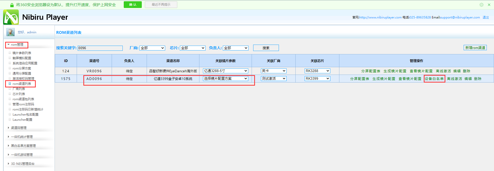

#### adb命令

- **设备显示：**adb devices

- **设备无线连接：**adb tcpip 5555

  ​						   adb connect IP地址（设备）

- **获取权限：adb disable-verity      

  ​                    adb reboot

  ​					adb shell setprop nibiru.root.allowed 1

  ​				    adb root

  ​                    adb remount

- **获取日志：**adb shell setprop persist.nibiru.logcat.flag 0

  ​                   adb logcat >log.log

- **截图：**adb shell screencap -p /sdcard/screeen.png

  **传送文件至电脑：**adb pull /sdcard/screeen.png d:/111

- **录屏：**adb shell screenrecord /sdcard/12.mp4

  **传送文件至电脑：**adb pull /sdcard/12.mp4 D:/111

- **删除应用：** adb root

  ​					adb remount

  ​					adb shell

  ​					cd system/app

  ​					ls

  ​					rm -r NibiruVRFileManager

  ​					reboot

  ​				

- **安装应用：**adb install -r 应用的文件路径

  > apkhelper.exe   可查看应用的包名

  adb install -t （强制安装）

  adb install  应用的文件路径

- **卸载应用：**adb uninstall 包名

- **删除系统应用：**

  > 进入系统目录，删除应用

  adb shell

  cd system/app

  rm -rf NibiruCreator  （应用名称） 删除文件夹

  rm XXX      删除文件

  adb reboot    ##如果删除的是系统应用，一定要重启后安装

- **查看包名/类名：**aapt dumping badging 文件路径

- **添加文件：**adb push 电脑文件路径     一体机文件路径（/sdcard/）

- **删除文件：**adb shell rm 12.mp4   / rm -r 111（文件夹）

- **新建文件夹：**adb shell mkdir  路径path/文件名foldelname（/sdcard/111）

- **查看系统渲染版本号：**adb shell dumping SurfaceFlinger --nremw |find "SF Version"

- **打印帧率（FPS）：**adb shell setprop nvr.debug.fps 1

- **查看帧率：**adb shell dumpsys gfxinfo 包名

- **输入键值：**adb shell input keyevent 键值（确定键23，返回4，上下左右19，20，21，22，音量加减24，25，Home3）

- **调用N键：**adb shell setprop nre.global.cmd menu_trigger

> 低电量

- **查看电量：**adb shell dumpsys battery

- **电量变为3%：**adb shell dumpsys battery set level 3

  ​					     adb shell dumpsys battery unplug

- **回到初始电量：**adb shell dumpsys battery reset

- **用adb命令启动app格式**：adb shell am start -n 包名/主类名
  举例：
  adb shell am start -n com.test.hm/com.test.hm.ui.MainActivity

  **用adb命令关闭已打开的app格式：**adb shell am force-stop 包名
  举例：
  adb shell am force-stop com.test.hm
  

---

**修改一体机的系统配置**

> 将build.prop文件下载到电脑中，在其中修改配置

adb shell setprop nibiru.root.allowed 1
adb root
adb remount
adb pull system/build.prop
修改build.prop:audio.offload.video=true修改为audio.offload.video=false

> 将修改好的build.prop文件上传至一体机中

adb push build.prop system/
adb shell chmod 644 system/build.prop
adb reboot

---

**写入key值：**

> 在channel_cfg.ini文件的内容修改为本账号的key值（个人中心可查看），再将channel_cfg.ini文件导入系统文件中，若要变成未写入key值状态，就将key值修改为其他值然后重新导入系统文件中

adb push C:\Users\Administrator\Desktop\channel_cfg.ini （文件路径）system/etc/（系统文件路径）

**可查看该文件是否成功导入**

adb shell

cd system/etc/

ls

---

#### 亿道835功能点

#### 高通烧写

除了835、845、821是UFS，其余均为eMMC

1. 下载并安装烧录工具软件与驱动

2. adb reboot edl进入烧写模式（按电源、调节声音的“-”“+”键可重启一体机）

   > VR9：PhoenixSuit.exe
   >
   > 其他一体机：QFIL.exe

3. 进入9008端口

   QFIL.exe----Configuration----Device Type

   > XR：eMMC
   >
   > 其他一体机：UFS

qfil文件从服务器中获取：WinSCP.exe（登录主机名、用户名、密码）

**服务器中的qfil文件**/home/data5/backup/VR1226

- 一个文件夹代表一个渠道，里边就是不同的版本，按时间分就好了

- 比如你要刷的渠道是1226，你就找1226这个文件夹，在里边拖一个新的到本地就好了

#### 打包

**putty_V0.63.0.0.43510830.exe**

路径：/home/data5/vrcores/core/qcom835_emdoor_vr/project1226.conf

**打包正式服：需`./qcom835_emdoor_vr_make.sh 1226 ota`**

#### 签名工具

> 用python命令进行签名

1. 将`NibiruCubeWorld.V1.0.1.20200921_6DOF.apk`文件放到签名工具的根目录下
2. 运行python命令，在根目录下形成一个`NibiruCubeWorld.V1.0.1.20200921_6DOF_signed.apk`文件
3. 将这个签名的signed.apk文件导入一体机中，完成签名

#### 版本ota升级

> 本地升级（12升级至13）

1. 先刷机进入烧写模式

   将一体机系统刷为12的版本

   

2. 将版本13的zip文件及其command文件上传至一体机中（上传时将command文件的末尾`_差分包`删去）

   

   

3. 在一体机中进行升级操作

> 在线升级

1. 刷机并联网

2. 将13的工具包上传到Nibiru后台

   

3. 创建一个nibiru.test空文件上传到一体机中

   

4. 在一体机中选择系统的在线升级

### 系统渲染-后台新增配置包名

### 一体机本地/服务器时间戳

`adb shell`

`cd data/nvr`

将`nibiru_mode_settings.xml`导入电脑，进行文件修改

再重新导入到一体机中

### 离线激活文件

### MAC地址校验

### 激活码不足

### 本机激活码与渠道码不匹配

清除本地所有激活记录后，重启机器，进入未激活界面

1. 修改build.prop 中的渠道号

 build.prop文件在  system/vendor 下面

push和pull之前都要root一下权限

把文件pull到桌面

adb pull system/vendor/build.prop C:\Users\nibirutest\Desktop

修改之后再push进去

2. 重新推入系统，重启机器

push之前要root一下

adb push C:\Users\nibirutest\Desktop\build.prop system/vendor/

push之后要赋值权限才能重启

adb shell

chmod 644 system/vendor/build.prop

3.  连接网络

### 刷机后新系统激活

1、先要Nibiru后台，该系统所属渠道下进入设备白名单添加所属设备MAC地址

2、然后联网激活，可激活成功